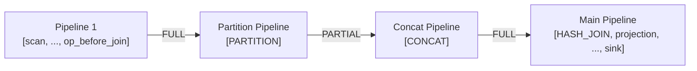
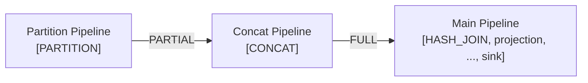
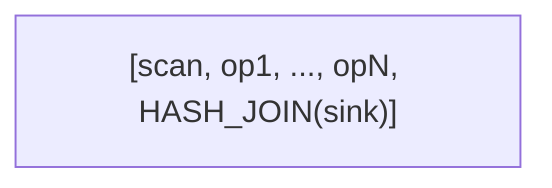
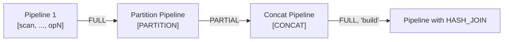
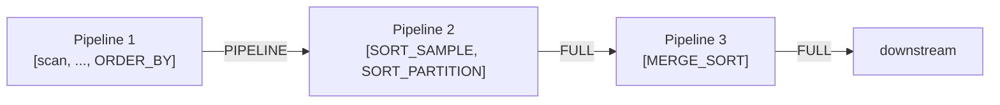
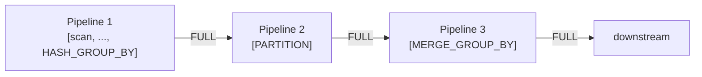
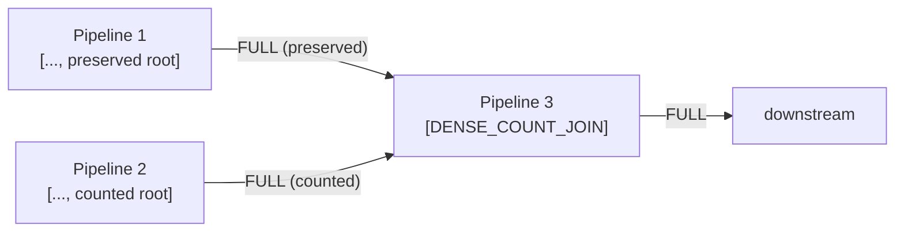
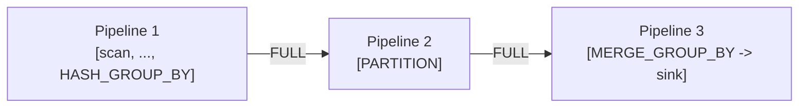
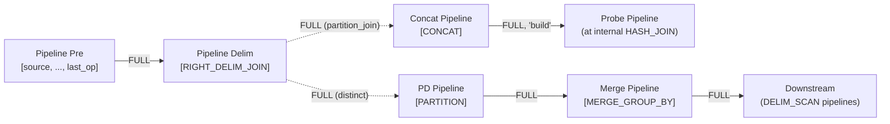
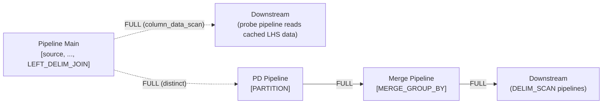

# Physical Plan Generation

This document covers three interconnected topics: translating DuckDB logical plans to Sirius physical operators (including the GPU pipeline operators inserted at plan time), constructing pipelines, and the pipeline shapes that result for distributed GPU execution.

## Part 1: Plan Generator

**File:** `src/planner/sirius_physical_plan_generator.cpp`

The `sirius_physical_plan_generator::create_plan()` method is the entry point. It:

1. Resolves types for each logical operator
2. Resolves column references via `ColumnBindingResolver`
3. Dispatches to operator-specific `create_plan()` overloads via a switch on `op.type`
4. Returns a `sirius_physical_operator` tree

### Operator Mapping Table

| DuckDB Logical Operator | Sirius Physical Operator | Plan Builder File |
|------------------------|--------------------------|-------------------|
| `LOGICAL_GET` | `TABLE_SCAN` | `src/planner/sirius_plan_get.cpp` |
| `LOGICAL_PROJECTION` | `PROJECTION` | `src/planner/sirius_plan_projection.cpp` |
| `LOGICAL_FILTER` | `FILTER` | `src/planner/sirius_plan_filter.cpp` |
| `LOGICAL_AGGREGATE_AND_GROUP_BY` | `HASH_GROUP_BY` / `UNGROUPED_AGGREGATE` | `src/planner/sirius_plan_aggregate.cpp` |
| `LOGICAL_COMPARISON_JOIN` | `HASH_JOIN` / `NESTED_LOOP_JOIN` | `src/planner/sirius_plan_comparison_join.cpp` |
| `LOGICAL_DELIM_JOIN` | `LEFT_DELIM_JOIN` / `RIGHT_DELIM_JOIN` | `src/planner/sirius_plan_comparison_join.cpp` |
| `LOGICAL_ORDER_BY` | `ORDER_BY` | `src/planner/sirius_plan_order.cpp` |
| `LOGICAL_TOP_N` | `TOP_N` | `src/planner/sirius_plan_top_n.cpp` |
| `LOGICAL_LIMIT` | `STREAMING_LIMIT` | `src/planner/sirius_plan_limit.cpp` |
| `LOGICAL_CHUNK_GET` | `COLUMN_DATA_SCAN` | `src/planner/sirius_plan_column_data_get.cpp` |
| `LOGICAL_DELIM_GET` | `DELIM_SCAN` | `src/planner/sirius_plan_delim_get.cpp` |
| `LOGICAL_EXPRESSION_GET` | `COLUMN_DATA_SCAN` | `src/planner/sirius_plan_expression_get.cpp` |
| `LOGICAL_MATERIALIZED_CTE` | `CTE` | `src/planner/sirius_plan_cte.cpp` |
| `LOGICAL_CTE_REF` | `CTE_SCAN` | `src/planner/sirius_plan_recursive_cte.cpp` (materialized CTE refs only — recursive CTEs are unsupported) |
| `LOGICAL_DUMMY_SCAN` | `DUMMY_SCAN` | `src/planner/sirius_plan_dummy_scan.cpp` |
| `LOGICAL_EMPTY_RESULT` | `EMPTY_RESULT` | `src/planner/sirius_plan_empty_result.cpp` |

**Unsupported operators** (throw `NotImplementedException`, triggering CPU fallback):
`LOGICAL_WINDOW`, `LOGICAL_UNNEST`, `LOGICAL_SAMPLE`, `LOGICAL_ANY_JOIN`, `LOGICAL_ASOF_JOIN`, `LOGICAL_CROSS_PRODUCT`, `LOGICAL_RECURSIVE_CTE`

**Unsupported expressions** are rejected the same way, during plan construction rather than at execution time. Wherever a plan builder translates a DuckDB expression via `sirius::ast::from_duckdb()`, a `nullptr` result (untranslatable expression) throws `NotImplementedException` so the query falls back to CPU instead of reaching the GPU evaluator with a hole in its expression list. Rejection sites: projections (`sirius_plan_projection.cpp`), filter predicates (`sirius_plan_filter.cpp`), pushed-down scan filters (`sirius_plan_get.cpp`, `src/op/scan/parquet_gpu_ingestible.cpp`, `sirius_physical_table_scan.cpp` — where a *skipped* pushdown translation is distinguished from a *failed* one so a predicate is never silently dropped), and join conditions (`src/expression/join_condition.cpp`). Nested-typed (STRUCT/LIST/MAP) columns are accepted for scan and projection passthrough but rejected as *operands* — in WHERE, GROUP BY, JOIN ON, and sort keys (`sirius_plan_order.cpp`, `sirius_plan_top_n.cpp`) — via `reject_nested_column_operation()` in `sirius_physical_plan_generator.cpp`. Two further non-operator reject conditions: any plan node whose output types contain `SQLNULL` (e.g. an uncast `NULL` in `VALUES`), and any aggregate expression the translator declines (e.g. ORDER BY aggregates lowered to `arg_min_null`/`create_sort_key`) — both throw in `sirius_physical_plan_generator.cpp` / `sirius_plan_aggregate.cpp`. Because rejection is a plan-capability decision, an unsupported expression falls back even when the input is empty.

### Join Planning

**File:** `src/planner/sirius_plan_comparison_join.cpp`

The `plan_comparison_join()` method selects the join implementation:

1. **Hash Join** — chosen when at least one equality condition exists. Checks `are_conditions_supported()` for mixed joins (equality plus an inequality, or a null-safe `IS NOT DISTINCT FROM` key mixed with a plain `=`, on disjoint columns). Created with `max_build_hash_table_bytes` limit.
2. **Nested Loop Join** — fallback for pure inequality joins where `PhysicalNestedLoopJoin::IsSupported()` returns true.

Left side = probe (streamed), right side = build (materialized).

Before either is chosen, `materialize_expression_join_keys()` pushes a projection below the join that turns complex equality-key expressions into real columns, rewriting the condition side to a plain reference so `PARTITION` (which hashes by column index) can consume it. It also materializes the *cast* on a null-safe key that will be routed to the mixed join's cuDF AST predicate: a routed key skips the hash-key path's `cudf::cast`, and a cuDF AST can only cast to INT64 / UINT64 / FLOAT64, so e.g. the INTEGER cast DuckDB inserts for a SMALLINT/INTEGER `IS NOT DISTINCT FROM` has to become a column. `are_conditions_supported()` rejects any routed null-safe key still carrying an untranslatable expression, so the join lands on the nested loop join (or CPU) instead of throwing mid-query.

### Aggregate Planning

**File:** `src/planner/sirius_plan_aggregate.cpp`

- **Ungrouped aggregate** — when no GROUP BY columns exist
- **Grouped aggregate** — hash-based GROUP BY using cuDF's `groupby()` API
- **AVG decomposition** — AVG is split into SUM + COUNT_VALID (cuDF doesn't support AVG directly)
- **COUNT(DISTINCT)** — implemented via `COLLECT_SET` aggregation, then counting unique rows
- **HUGEINT downcast** — HUGEINT types are downcast to BIGINT (cuDF doesn't support int128)
- **Unsupported aggregate expressions** — `translate_expressions()` rejects any aggregate expression `from_duckdb` cannot translate (see *Unsupported expressions* above), and `can_use_partitioned_aggregate()` declines on a failed translation

### Filter Pushdown

**File:** `src/planner/sirius_plan_get.cpp`

When a `LogicalGet` has table filters and the table function supports `FILTER_PUSHDOWN`:
- Filters are pushed into the `sirius_physical_table_scan` operator
- Filter columns are added to `projection_ids` even if not in the output
- A separate `sirius_physical_filter` is created for column types not supported by the table function

### Projection Elision

**File:** `src/planner/sirius_plan_projection.cpp`

Projections are omitted when columns are already in the correct order (passthrough case like `PROJECTION(#0, #1, #2, ...)`).

### Projection Folding

After the operator tree is built, `create_plan()` runs `fold_adjacent_projections()` over the whole plan as a final pass. Sirius routes every planner-created projection through `push_projection()`, which both elides identity passthrough projections and, when its child is already a projection, composes the two select lists into one. The standalone `fold_adjacent_projections()` post-pass then collapses any remaining `PROJECTION → PROJECTION` stacks anywhere in the tree — including projection pairs that arise from separate plan-builder steps (filter `projection_map` reordering, aggregate child/filter hoisting, table-scan unsupported-filter projections, and the user's `SELECT` list) and projections sitting under other operators such as joins.

Composition substitutes each outer select-list reference (`#i`) with a clone of the inner projection's `select_list[i]`. Folding is refused when either select list has a null slot (a defensive backstop — plan construction rejects untranslatable expressions up front, so a null slot should not occur) or when a non-trivial inner expression would be duplicated across multiple outer reference sites; only immediate parent/child projection pairs are candidates, never folds across non-projection operators. The result is a single GPU expression-evaluation stage where multiple stacked projections would otherwise each run `expression_evaluator` over every batch.

## Part 2: Pipeline Structure

### `sirius_pipeline`

**File:** `src/include/pipeline/sirius_pipeline.hpp`

A pipeline is an ordered list of operators:

| Field | Type | Purpose |
|-------|------|---------|
| `source` | `optional_ptr<sirius_physical_operator>` | Alias for the **first** operator in `operators` |
| `operators` | `vector<reference<sirius_physical_operator>>` | **All** operators in execution order, including source and sink |
| `sink` | `optional_ptr<sirius_physical_operator>` | Alias for the **last** operator in `operators` |
| `dependencies` | `vector<shared_ptr<sirius_pipeline>>` | Pipelines that must finish before this one starts |
| `parents` | `vector<weak_ptr<sirius_pipeline>>` | Pipelines that depend on this one finishing |
| `tasks_created` | `atomic<size_t>` | Number of tasks created for this pipeline |
| `tasks_completed` | `atomic<size_t>` | Number of tasks that have finished |
| `pipeline_finished` | `atomic<bool>` | Set when all tasks are done and source is drained |

> **Important:** Unlike DuckDB's pipeline model where `source` and `sink` are separate from the `operators` list, Sirius finalizes pipelines at the end of `initialize_internal()` (line ~1133) by pushing the sink into `operators` and setting `source = &operators[0]`. After finalization, `operators` contains **every** operator from source to sink inclusive. `get_operators()` returns this full list, which `compute_task()` iterates over to call each operator's `execute()`.

Key methods:
- `mark_task_created()` — increments `tasks_created`, starts NVTX range on first task
- `mark_task_completed()` — increments `tasks_completed`, calls `update_pipeline_status()`
- `update_pipeline_status()` — checks completion: a pipeline finishes when any of its operators has exhausted a limit, or when its first node reports `is_source_pipeline_finished()` and `all_ports_empty()`, and `tasks_created == tasks_completed`. Source-specific completion (a drained DuckDB source vs. a closed/drained scan `split_connector`) is encapsulated behind the operator's `is_source_pipeline_finished()` rather than a per-operator-type switch.
- `is_ready()` — marks pipeline ready and reverses operators to execution order
- `register_new_batch_index()` / `update_batch_index()` — batch ordering for order-preserving execution

### `sirius_meta_pipeline`

**File:** `src/include/pipeline/sirius_meta_pipeline.hpp`

Groups pipelines that share the same sink operator. Manages inter-pipeline dependencies and build order.

Key methods:
- `build(operator)` — delegates to `operator.build_pipelines()` on the base pipeline
- `ready()` — calls `is_ready()` on all pipelines recursively
- `create_child_meta_pipeline(current, op)` — creates a child for blocking operator build inputs
- `create_pipeline()` — adds a new pipeline sharing the same sink
- `add_dependencies_from(dependent, start, including)` — collects pipelines after a point as dependencies

Build order rules:
1. Join build side before probe side
2. Child meta-pipelines after all pipelines for the current operator
3. Child pipeline auto-depends on current streaming pipeline and all siblings

### `sirius_pipeline_build_state`

**File:** `src/include/pipeline/sirius_pipeline_build_state.hpp`

Provides controlled write access to pipeline internals during construction:
- `set_pipeline_source()` / `set_pipeline_sink()` — assign source/sink operators
- `add_pipeline_operator()` — add intermediate operator
- `create_child_pipeline()` — delegate to engine
- `delim_join_dependencies` — maps scan operators to their delim join producer pipelines
- `cte_dependencies` — maps CTE scan operators to their materialization pipelines

### `build_pipelines()` Patterns

Each operator implements `build_pipelines(current, meta_pipeline)`. Note that during this phase, operators are added in DuckDB's style (separate source/operators/sink). The finalization step at the end of `initialize_internal()` then merges them into a single `operators` list (see [Pipeline Finalization](#pipeline-finalization) below).

**Streaming operators** (FILTER, PROJECTION, LIMIT):
```
state.add_pipeline_operator(current, *this);
children[0]->build_pipelines(current, meta_pipeline);
```

**Blocking operators** (HASH_JOIN):
```
state.add_pipeline_operator(current, *this);
// Create child meta-pipeline for build side
auto& child = meta_pipeline.create_child_meta_pipeline(current, *this);
child.build(*children[1]);  // Build RHS first
children[0]->build_pipelines(current, meta_pipeline);  // Probe in current
```

**Source operators** (scans):
```
state.set_pipeline_source(current, *this);
```

**Sink parents** (PARTITION, RIGHT_DELIM_JOIN, DENSE_COUNT_JOIN): the base `is_sink()` returns true for any operator whose tree parent is one of these, because the parent consumes each child's output through a repository. The parent therefore only creates its own meta-pipeline and lets each child's `build_pipelines()` terminate the child's pipeline (PARTITION shown; DENSE_COUNT_JOIN applies the same call to its counted and then preserved child):
```
D_ASSERT(children[0]->is_sink());
auto& partition_meta = meta_pipeline.create_child_meta_pipeline(current, *this);
children[0]->build_pipelines(*partition_meta.get_base_pipeline(), partition_meta);
```

**CTE operator**:
```
auto& child = meta_pipeline.create_child_meta_pipeline(current, *this);
child.build(*children[0]);  // Materialization pipeline
// Register CTE scan dependencies
for (auto& scan : cte_scans) {
    state.cte_dependencies[scan] = child.get_base_pipeline();
}
children[1]->build_pipelines(current, meta_pipeline);  // Reference side
```

### Pipeline Finalization

Pipelines reach their final shape during construction: `create_pipeline()` pre-populates `operators` with the meta-pipeline's sink, per-operator `build_pipelines` appends intermediates and sources as it recurses, and `sirius_pipeline::is_ready()` reverses the list and derives `source`/`sink` from it.

After `is_ready()`:
- `operators` contains **all** operators from source to sink inclusive
- `source` points to `operators[0]` (the first operator)
- `sink` points to `operators.back()`
- `get_operators()` returns this full list

`finalize_pipeline_structure()` in `sirius_pipeline_converter` then populates each pipeline's `dependencies` from the wiring-derived parents, inserting a join's build-side CONCAT producer at slot 0 — `link_join_partition_siblings()` and `reorder_pipelines_topologically()` read the slots positionally.

## Part 3: Pipeline Shapes

The plan generator inserts every GPU pipeline operator into the plan tree (Part 1), so `sirius_pipeline_converter::convert()` (`src/pipeline/sirius_pipeline_converter.cpp`) is a pure topology pass over the meta-pipeline tree:

1. `schedule_pipelines()` — walk the meta-pipeline tree and schedule pipelines in dependency order
2. `compute_repository_wiring()` — emit sink→consumer wiring descriptors via tree-parent lookup; the logical consumer's `input_port_for(producer)` and `input_barrier_for(producer)` hooks pick each edge's port and barrier semantics
3. `setup_pipeline_parents()` — derive parent pipeline edges from the wiring descriptors
4. `finalize_pipeline_structure()` — populate `dependencies`, build-side-first for joins (see [Pipeline Finalization](#pipeline-finalization))
5. `link_join_partition_siblings()` — link PARTITION/JOIN/CONCAT sibling chains
6. `configure_partition_min_partitions()` — apply the multi-GPU partition floor
7. `reorder_pipelines_topologically()` — permute the schedule into a strict leaf-first topological order (every pipeline after its producers) and renumber pipeline IDs to match; join dependencies stay build-side-first so a join publishes its dynamic filters before the probe-side scans they prune are launched

`sirius_engine::initialize_internal()` is a thin orchestrator calling `sirius_pipeline_converter(build_ctx, op_params).convert(*root_pipeline)` and materializing the wiring descriptors into runtime repositories and ports.

The plan-time wraps introduce new operators and **data repositories between pipelines**. Repositories are never placed in the middle of a pipeline — they always connect the sink of one pipeline to the source of the next.

In the diagrams below, `[A, B, C]` denotes a pipeline where A is `operators[0]` (source), C is `operators.back()` (sink), and B is intermediate. After finalization, each operator appears **exactly once** in its pipeline's `operators` list. Solid edges denote data repositories connecting pipelines, labeled with the barrier type (e.g., `FULL`, `PARTIAL`, `PIPELINE`). Dashed edges indicate internal pushes within an operator's `sink()` method.

### TABLE_SCAN Rewrite

`wrap_table_scan_source()` resolves a source adapter for Native, Standard
Parquet, Sirius-owned Parquet or Iceberg and wraps its `gpu_ingestible` in a
`GPU_SCAN` operator. The replacement keeps the `TABLE_SCAN` tree position and
pipeline; no separate scan pipeline is created. Stream uses its adapter to
construct a direct `STREAMING_SOURCE` operator. Shared planning handles
projection, filters, schemas and dynamic-filter wrappers.

Before lowering consumes bindings and filters, the planner captures candidate
evidence and consumer requirements. Each scan receives an immutable ticket with
its output layouts in a plan-owned registry. Provider preparation that needs
SQL finishes during planning; native storage is retained without checkpoint
leases.

Transparent execution retains the validated physical plan and reuses it when
the pin-registry epoch is unchanged. An epoch change rebuilds the plan and
checks correspondence again. During `prepare_for_query`, the scan manager
activates the registry, starts native transactions, acquires shared checkpoint
leases and prepares fresh native metadata walks. Cleanup closes the registry
and releases leases after mandatory drain.

Unsupported sources or failed correspondence checks decline GPU execution.
Standard Parquet and Iceberg retain unverified compatibility paths; see
[Shared Scan Framework](shared-scan-framework.md) for their evidence limits.

The scan manager serves pin-cache hits through `cached_databatch_provider` and
fresh scans through `split_provider`. Both feed the operator's `split_connector`;
the operator pulls work in `get_next_task_input_data()`. See
[Scan Manager](scan.md#scan-manager).

### HASH_JOIN Probe Side

When HASH_JOIN appears as an intermediate operator, a PARTITION and CONCAT are inserted before it, each in its own pipeline:

**Before:**


**After (join is NOT the first intermediate operator):**


**After (join IS the first intermediate operator):**


- When the join is not the first intermediate operator, Pipeline 1 is created with all operators before the join; the last one becomes the sink (acts as a pipeline breaker so PARTITION can see total input size). The repository from Pipeline 1 to Partition Pipeline uses `FULL` barrier (intermediate operator as sink — default)
- When the join IS the first intermediate operator (`join_pos == 0`), the partition pipeline starts from the current source directly (no Pipeline 1)
- PARTITION and CONCAT are each in their own single-operator pipeline
- The repository from PARTITION uses `PARTIAL` barrier (since the downstream is CONCAT — line 1014)
- The repository from CONCAT to the main pipeline uses `FULL` barrier (default)

For multiple joins in the same pipeline, the pattern repeats — each join gets its own PARTITION → CONCAT pair, with subsequent ones using the previous CONCAT as their starting point.

### HASH_JOIN Build Side

When HASH_JOIN is the sink of a pipeline (build side), the same PARTITION → CONCAT pattern is applied. There is always a pipeline breaker before PARTITION so that the total input size is known for determining partition count:

**Before:**


**After:**


- Pipeline 1's sink is the last intermediate operator before HASH_JOIN (pipeline breaker); it connects to the Partition Pipeline with `FULL` barrier (default)
- PARTITION → CONCAT uses `PARTIAL` barrier (downstream is CONCAT — line 1014)
- Build-side CONCAT pushes to the HASH_JOIN's `"build"` port with `FULL` barrier (default)
- The probe and build PARTITION operators are linked as siblings for partition count coordination

For a dynamic-filter-producing `BUILD_PROBE` join, the build CONCAT switches to `concat_all` and
its synchronous `"build"`-port push completes filter construction, multi-GPU replication, and
channel publication before downstream task creation follows that join into its **immediate** probe
producer. In a **broadcast** join there are `num_gpus` build CONCATs (one per replicated slot), each
doing a `concat_all` push of the full build; the first to arrive publishes (exactly-once via the
`OPEN -> PUBLISHING` compare-exchange). This edge ordering does not gate a base scan reached
transitively through an intervening join; such a scan samples the channel opportunistically under
normal scheduler order. See
[Immediate-probe ordering](dynamic-filters.md#immediate-probe-ordering) and
[Transitive scan targets and publication timing](dynamic-filters.md#transitive-scan-targets-and-publication-timing).

### ORDER_BY → 3-Phase Sort



1. **Pipeline 1**: Current pipeline keeps ORDER_BY as sink (local sort per batch)
2. **Pipeline 2**: SORT_SAMPLE and SORT_PARTITION run back-to-back in the same `gpu_pipeline_task`. `PIPELINE` barrier from Pipeline 1 — batches arrive as produced; SORT_SAMPLE overrides `get_next_task_hint()` to wait for N samples before computing boundaries; SORT_PARTITION reads boundaries directly from SORT_SAMPLE via `_sample_op`
3. **Pipeline 3**: MERGE_SORT. `FULL` barrier — must wait for all partitions. Downstream pipelines that previously used ORDER_BY as source are updated to use MERGE_SORT

### HASH_GROUP_BY



1. **Pipeline 1**: Current pipeline keeps HASH_GROUP_BY as sink (partial aggregation per batch). `FULL` barrier (HASH_GROUP_BY falls to default wiring)
2. **Pipeline 2**: PARTITION. Repository to MERGE_GROUP_BY uses `FULL` barrier (downstream is not CONCAT — `PARTIAL` is only used when PARTITION feeds directly into CONCAT)
3. **Pipeline 3**: MERGE_GROUP_BY. Downstream pipelines updated to use MERGE_GROUP_BY as source

> Pipeline 3 is usually not standalone: Sirius automatically folds MERGE_GROUP_BY into the
> downstream sink's pipeline as an intermediate. See [Merge fusion](#merge-fusion) below.

### DENSE_COUNT_JOIN



DENSE_COUNT_JOIN is a sink parent (see [`build_pipelines()` Patterns](#build_pipelines-patterns)), so each direct child terminates its own producer pipeline and feeds one input port through a `FULL` barrier; the counted producer is built first. Each root may itself be a scan, a streaming chain over a scan, `[HASH_JOIN]` (fed by its own CONCAT/PARTITION chains), `[MERGE_GROUP_BY, FILTER]` (a fused merge under a HAVING filter), `[MERGE_SORT]`, or another `[DENSE_COUNT_JOIN]`. Delim-join, materialized-CTE and delim/CTE scan roots are declined at plan time because their output does not arrive through a child-owned pipeline, and a delim join is declined at any depth of an input because the DENSE_COUNT_JOIN task hint can poll a MARK hash join inside the delim subtree before its sizing partitions have run.

The repository to downstream uses `FULL` barrier (`PARTIAL` is only used when DENSE_COUNT_JOIN feeds the probe-side PARTITION of a HASH_JOIN outside the right family, see `sirius_physical_partition::input_barrier_for`).

### UNGROUPED_AGGREGATE


No PARTITION needed. MERGE_AGGREGATE collects partial aggregates from Pipeline 1.

### TOP_N


MERGE_TOP_N merges local top-N results.

> Pipeline 2 usually folds MERGE_TOP_N into the downstream sink's pipeline rather than forming its
> own. See [Merge fusion](#merge-fusion) below.

### Merge fusion

An eligible `MERGE_GROUP_BY` or `MERGE_TOP_N` does **not** open its own terminal pipeline. Instead it joins its downstream sink's pipeline as an intermediate operator, removing one task launch and one repository round-trip (typically `merge → RESULT_COLLECTOR` at the query tail):



Eligibility is decided at plan time by `mark_fusable_merge_pipelines` (`sirius_physical_plan_generator.cpp`), which walks parent pointers from each merge to the first downstream sink. Fusion applies when that path is unary and streaming and the sink accepts a fused input; the merge's own `build_pipelines` override then adds itself to the current pipeline and recurses into its child (which still cuts the upstream boundary). The following are **excluded** and keep the standalone merge boundary:

- **Join / CTE / delim terminals** (`HASH_JOIN`, `NESTED_LOOP_JOIN`, `CTE`, `LEFT/RIGHT_DELIM_JOIN`, `DENSE_COUNT_JOIN`) — multiple inputs or bespoke sink wiring. A streaming operator directly under a sink parent is itself the fusion terminal (e.g. `[MERGE_GROUP_BY, FILTER]` feeding a PARTITION or DENSE_COUNT_JOIN port).
- **Partition sinks** (`PARTITION`, `SORT_PARTITION`) — require complete upstream input in one task.
- **Delim-owned merges** — the distinct-root merge inside a delim join needs its dedicated sink wiring.
- **`MERGE_AGGREGATE`** (ungrouped aggregate) — uses a different partial-result handoff.

Total-input structural sinks such as `ORDER_BY`, `TOP_N`, and an outer `GROUP BY` **are** fusable: they already buffer their full input, so folding the merge in does not change when they observe complete data.

### DELIM_JOIN

Decorrelated correlated-subquery join. Both variants hold two internal operators:
- `join` — the HASH_JOIN doing the join-back (one child replaced by a cached-data scan)
- `distinct_root` — the `MERGE_GROUP_BY → PARTITION_DISTINCT → DISTINCT` chain that dedups the correlated key for the subquery's DELIM_SCANs (`distinct` is a non-owning borrow of the bottom DISTINCT)

The delim join is a **fan-out sink that performs no data transformation**: `execute()` is a pass-through, and its base `sink()` forwards each input batch unchanged to two branch pipelines — the DISTINCT branch and the join-feeding branch (`partition_join` for RIGHT, `column_data_scan` for LEFT). It owns the fan-out (two `next_port_after_sink` edges) and anchors the construct (the `distinct` / `join` / `column_data_scan` / `delim_scans` pointers and the DELIM_SCAN dependency); the dedup and the join happen in the sub-operators.

#### RIGHT_DELIM_JOIN

Ctor: extract the RHS from the internal join, replace it with a `dummy_scan` placeholder; the RHS becomes `children[0]`. `wrap_join` wraps the build side as `CONCAT_build → PARTITION_build → DUMMY_SCAN`, and `partition_join` points at that PARTITION_build. With intermediate operators before the delim join (`operators.size() > 0`), a pipeline breaker is inserted:



With no intermediate operators, no breaker is needed — RIGHT_DELIM_JOIN is the current pipeline's sink directly.

- `partition_join` (PARTITION_build) is a single-op pipeline fed by the fan-out; its build CONCAT feeds the HASH_JOIN `"build"` port.
- Probe and build partitions are linked as siblings; the inner join is identified via its tree parent (`link_join_partition_siblings`) so the build (distinct) side drives the partition count.

#### LEFT_DELIM_JOIN

Ctor: extract the LHS from the internal join, replace it with a `column_data_scan`; the LHS becomes `children[0]`. No breaker and no partition_join/concat pair.



- `column_data_scan` is the source of the join's probe pipeline (`[column_data_scan, HASH_JOIN, ..., outer_sink]`), fed by the fan-out.
- The internal HASH_JOIN's build side (the subquery) gets standard build splitting via `join->build_pipelines()`.

#### Key Differences

| Aspect | RIGHT_DELIM_JOIN | LEFT_DELIM_JOIN |
|--------|-----------------|-----------------|
| Side eliminated | RHS | LHS |
| Internal join child replaced | RHS → `dummy_scan` | LHS → `column_data_scan` |
| Pipeline breaker | Yes (if intermediate ops exist) | Never |
| Build-side data path | `partition_join` → CONCAT → HASH_JOIN "build" port | Standard HASH_JOIN build handling (correlated subquery) |
| Inner-join build subtree | CONCAT_build → PARTITION_build (`partition_join`) → DUMMY_SCAN placeholder; `partition_join` is a framework-scheduled pipeline fed by the fan-out | Real correlated-subquery subtree under CONCAT_build |
| Cached data scan | N/A | `column_data_scan` feeds probe side |

## Part 4: Port Wiring

### `insert_repository()`

**File:** `src/sirius_engine.cpp`

Two overloads handle repository creation:

1. **Between two operators in different pipelines**: Creates a `shared_data_repository` keyed by `(operator_id, port_id)`, connects it to the port, and adds the pipeline dependency.
2. **Between a partition and its consumer**: Creates a partitioned repository with the appropriate barrier type.

### Barrier Types

| Type | Semantics | Example |
|------|-----------|---------|
| `FULL` | Downstream waits for all upstream data before starting | Hash join build side |
| `PARTIAL` | Downstream can consume data incrementally as it arrives | CONCAT after PARTITION (streaming joins) |
| `PIPELINE` | No synchronization — data flows immediately | Within a single pipeline |

The barrier type is set during `insert_repository()` and checked by the base `get_next_task_hint()` method to determine operator readiness.

### Port Structure

```cpp
struct port {
    MemoryBarrierType type;
    cucascade::shared_data_repository* repo;
    shared_ptr<sirius_pipeline> src_pipeline;
    shared_ptr<sirius_pipeline> dest_pipeline;
};
```

Operators access their ports by name:
- `"default"` — primary input (most operators)
- `"build"` — build-side input (hash join)
