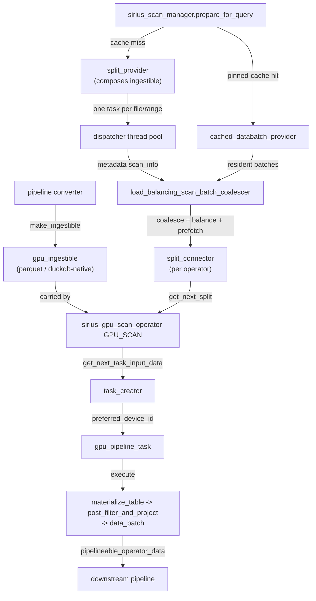

# Scan Subsystem

This document covers the scan subsystem end-to-end: how data enters Super Sirius from storage through the unified GPU scan operator and its per-format `gpu_ingestible` sources, the scan manager that produces and balances scan splits, pinned-table caching, GPU decode of DuckDB-native storage, and the Sirius IO layer underneath.

## Binding and runtime contracts

Registered source adapters provide binding evidence and runtime construction.
Each scan has an immutable consumer ticket in a plan-owned registry. The registry
is activated for execution and closed after drain. Standard Parquet and Iceberg
retain unverified compatibility paths where provider evidence is unavailable.

Fresh native and Parquet splits carry slice certificates through coalescing,
prefetch and decode. These validate the consumer, ranges and retained
dependencies. The scan manager owns native checkpoint leases for execution;
Parquet certificates retain file occurrences, metadata and datasource owners,
and Iceberg also retains delete-data owners. Pinned batches keep their existing
validation. Stream has a consumer ticket without file splits.

Cleanup drains outstanding work before closing the registry and releasing
leases. CPU replay requires an attempt-local result confirming that leases were
released or execution was never entered. Failed drain prohibits replay.

See [Shared Scan Framework](shared-scan-framework.md) for adapter APIs, the full
execution lifecycle and current evidence limits.

## Overview

The GPU scan path is a single unified source operator, `sirius_gpu_scan_operator` (physical type `GPU_SCAN`). It carries no format-specific code: it pulls pre-built splits off a `split_connector` and delegates per-split materialization to an installed **`gpu_ingestible`**. One `gpu_ingestible` implementation exists per source format:

| Format | Ingestible | Per-table bind data | Source |
|--------|-----------|---------------------|--------|
| Parquet (local or object-store) | `parquet_gpu_ingestible` | `parquet_ingestible_table_info` | `cudf::io::read_parquet` over row-group slices |
| DuckDB-native `.duckdb` tables | `duckdb_native_gpu_ingestible` | `duckdb_native_ingestible_table_info` | GPU decode of per-row-group storage segments |

The pipeline converter rewrites a DuckDB table scan into a `GPU_SCAN` source: it lowers the bind data into the appropriate `ingestible_table_info`, calls the free `make_ingestible(...)` factory to build the `gpu_ingestible`, constructs the operator carrying it, and inserts it at `operators[0]` of the pipeline. When a dynamic-filter channel is wired to the scan, a `DYNAMIC_FILTER` operator sits directly above it (see [Dynamic Filters](dynamic-filters.md)). No separate metadata pipeline is created.

Before a query runs, `sirius_scan_manager::prepare_for_query` walks the plan's `GPU_SCAN` operators. For each it either (a) matches a pinned-table cache entry and serves the scan from cached batches, or (b) builds a `split_provider` over the operator's ingestible. A single per-query sequencer (`load_balancing_scan_batch_coalescer`) drives metadata production, coalesces the output into right-sized data batches, balances each batch onto a GPU, and pushes the resulting splits onto each operator's `split_connector`.

Data reaches the GPU through the Sirius IO subsystem (`io::sirius_ioctx` / `io::sirius_datasource`, with a pinned-memory prefetching cache) — see the IO sections later in this document. The scan path consumes that layer: each split carries prefetch hints, and the read for a split goes through the `sirius_ioctx` its backend resolves to. The target device travels with the request.

## Scan Operator

### `sirius_gpu_scan_operator` — `GPU_SCAN`
**File:** `src/include/op/scan/sirius_gpu_scan_operator.hpp`, `src/op/scan/sirius_gpu_scan_operator.cpp`

The single GPU scan source operator. It owns:

- a `std::shared_ptr<gpu_ingestible>` — the installed per-format source, built by the pipeline converter and parked on the operator;
- a `std::shared_ptr<split_connector>` — the blocking queue the scan manager pushes splits into.

**Source interface.** As a pipeline source the operator exposes `get_next_task_hint()` / `all_ports_empty()` (both keyed off `split_connector::is_closed()`) and `get_next_task_input_data()`, which blocks inside `split_connector::get_next_split()` until a split arrives or the connector is closed and drained. Each pulled split is a `scan_operator_input`; on dequeue the operator issues an immediate prefetch hint for the split's byte ranges.

**Execution.** `execute(input_data, stream)` runs one split:

1. `gpu_ingestible::materialize_table(split, stream)` produces a `filtered_table` — the materialized `cudf::table` (wrapped in an `owning_table_view`) plus a `filter_state` tag describing how much filter/projection the materialize step already applied.
2. If the tag is `ROW_FILTERED_AND_PROJECTED` the table is already in final output layout and is released directly; otherwise `gpu_ingestible::post_filter_and_project(...)` applies any pending row filter and projection.
3. If the plan carries a compressed-materialization physical sidecar, exact runtime bounds verify wider-to-narrower casts for columns containing non-null values before the table is normalized to that complete physical schema. Such a sidecar exists only for scans the pinned cache serves with pin-time-narrowed columns (the plan-time residency gate); fresh unpinned scans carry no sidecar and skip normalization entirely. A resident cached input without an override is restored to the native schema when its stored numeric carrier is narrow. Fresh feature-off scans retain their existing natural shape and types. See [Compressed Materialization](compressed-materialization.md) for the narrowing/restoration rules and [Compressed Pinning](compressed-pinning.md) for Simpatico-compressed pinned chunks.
4. The result is wrapped in a `data_batch` tagged with the split's target `memory_space` and returned as a `pipelineable_operator_data` for the downstream pipeline.

The operator handles two split shapes transparently, both delivered as `scan_operator_input`: a **fresh read** (the input carries a `scan_info`, materialized via the ingestible) and a **pinned-cache hit** (the input carries a resident `data_batch`, filtered when required and normalized to the planned carrier schema). The operator never sees the source format directly.

Before execution, a resident split is converted or decompressed to a plain GPU table when necessary. An unmasked split with no filtering ahead of it — unfiltered, or decode-row-filtered by the pushdown decode — may detach that per-query table: a split needing no carrier cast transfers it directly to the output, while a carrier-casting split keeps the wrapper as the retained source of a transactional steal in which execute builds every replacement column before committing the take, so an OOM mid-cast leaves the split rematerializable. Because the transactional steal bypasses `post_filter_and_project`, a decode-row-filtered split takes it only when the ingestible reports its output assembly as a leading identity (no partition synthesis, no reordering); a width match alone cannot prove that, since trailing pure-filter columns can offset synthesized output columns. Masked or still-to-be-filtered splits retain the wrapper view, which preserves the source for copy-based filtering.

`no_history_peak_memory_estimate()` uses the larger of stored and working-set bytes for resident inputs that need no carrier conversion. For a known conversion it adds the exact destination bytes to the working set. The named maximum carrier expansion (8) is used only when a converting destination cannot be sized. A resident input with a physical sidecar but no reported conversion reserves the working set plus stored bytes as a source-bounded floor. For fresh reads the estimate remains 8 times the projected-column estimate plus decoded filter-only column buffers. The projected-column estimate remains the execution-history basis, and history-based reservations are clamped to the known decoded column-buffer footprint.

> `sirius_physical_table_scan` (`TABLE_SCAN`) remains only as the plan-time carrier that `wrap_table_scan_source` consumes; the read path for parquet and DuckDB-native tables runs entirely through `GPU_SCAN`.

## gpu_ingestible

**Files:** `src/include/op/scan/gpu_ingestible.hpp`, `gpu_ingestible_types.hpp`, `src/op/scan/gpu_ingestible.cpp`; implementations `parquet_gpu_ingestible.cpp`, `duckdb_native_gpu_ingestible.cpp`.

`gpu_ingestible` is the abstract source of cuDF tables — one implementation per data format. It is **composed twice**: by the `split_provider` (metadata-side, to enumerate work) and by the `sirius_gpu_scan_operator` (execution-side, to materialize each split). It inherits `enable_shared_from_this` so the provider can borrow it non-owningly while the operator holds the single owning `shared_ptr`.

### Interface

| Method | Role |
|--------|------|
| `has_processed_all_metadata()` | Thread-safe snapshot: is all metadata enumerated? Typically an atomic cursor vs. a precomputed total. |
| `next_split_provider(resolve)` | Atomically claim the next metadata unit and return a callable that produces its `scan_info`(s); `resolve` maps each file path to its ioctx. Null when nothing left to claim. |
| `create_batch_coalescer()` | Build the format's `batch_coalescer`, which bundles per-unit metadata into right-sized data-batch splits. |
| `materialize_table(split, stream)` | Produce the `filtered_table` for one split (dispatches to `materialize_metadata_to_table` for a fresh read, or wraps the resident batch for a cache hit). |
| `materialize_metadata_to_table(info, mem_space, stream)` | Issue the read/decode for one split into a `cudf::table`. `mem_space` names the destination: its allocator is where the decoded columns land. It does not select an ioctx. |
| `post_filter_and_project(table, mem_space, stream)` | Apply a pending post-decode filter and/or projection to output layout. |
| `table_info()` | The per-table bind data (`ingestible_table_info`). |
| `materialized_column_order()` | Storage indices in the exact order `materialize_table` emits columns (output columns first, then pure-filter columns). The pinned-cache path serves columns in this order so a cached batch is laid out identically to a fresh read. |

### Bind data vs. split descriptors

Two polymorphic carriers separate per-table from per-split state (`gpu_ingestible_types.hpp`):

- **`ingestible_table_info`** — built once by the pipeline converter from the DuckDB binding, parked on the operator. Exposes `column_names()` and `file_paths()` (used for pinned-cache matching). Implementations: `parquet_ingestible_table_info`, `duckdb_native_ingestible_table_info`.
- **`scan_info`** — one per emitted split. Carries the per-split read description and optional prefetch `fadvise_entries()` (computed only when the bound datasource has a prefetching cache), projected-column estimate, and decoded column-buffer estimate. Implementations: `parquet_split_info` (the data-batch split), `parquet_file_scan_info` (the per-file metadata unit), `duckdb_native_scan_info`.

### `filtered_table` / `filter_state`

`materialize_table` returns a `filtered_table` = an `owning_table_view` plus a `filter_state` tag recording how much filter+projection the materialize step already absorbed:

| State | Meaning |
|-------|---------|
| `UNFILTERED` | No filter applied (e.g. a pinned table, or duckdb-native which always filters post-decode). |
| `ROWGROUP_FILTERED` | Row groups pruned by statistics only. |
| `ROW_FILTERED` | The reader applied the row-level filter (parquet reader-side pushdown). |
| `ROW_FILTERED_AND_PROJECTED` | Fully assembled to output layout (parquet hive-partition path, or a per-query-cached table). |

The operator skips `post_filter_and_project` only when the state is already `ROW_FILTERED_AND_PROJECTED`.

### Factories

There is no factory class. Each implementation provides a free `make_ingestible(std::unique_ptr<...table_info>)` overload (defined in its `.cpp`); the pipeline converter calls the right overload by the concrete `table_info` type it built.

### Parquet ingestible

`parquet_gpu_ingestible` (`parquet_gpu_ingestible.{hpp,cpp}`) builds the canonical `scan_plan` and shared `parquet_reader_options` (column projection only) once in its constructor, and pre-coalesces the DuckDB filter into a stored expression (partition-column filters dropped — DuckDB already prunes the file list by hive value). `next_split_provider` hands out **one file at a time**: each metadata task opens the file's `sirius_datasource`, reuses or parses+caches the footer, runs the FLBA-decimal pushdown-safety probe, translates the filter to a cuDF AST and prunes row groups by statistics, estimates each surviving row group's projected data columns and all decoded column buffers (plus the partition columns the split will synthesize, which count toward both estimates), and emits one `parquet_file_scan_info`. A column-less scan's row-count carrier (see `scan_plan` below) is resolved per file: a file that lacks the carrier column, or has no row groups to resolve it against, keeps natural-batch reader options and is sized as the full-width read it is. The coalescer caps batches on decoded column-buffer bytes, while preserving projected-column bytes separately for memory history, and never puts files with different reader options in one split. `materialize_metadata_to_table` reads the bundled row-group slices via `cudf::io::read_parquet` (re-translating the filter on the task-local stream for reader-side pushdown unless the per-file probe disabled it), and assembles hive-partition output inline. Reader-side filter pushdown is a per-split decision.

### DuckDB-native ingestible

`duckdb_native_gpu_ingestible` (`duckdb_native_gpu_ingestible.{hpp,cpp}`) prepares a serial walk plan in its constructor (`prepare_duckdb_native_walk`: partition statistics, projected-type viability gate, and filter-stat row-group pruning — a non-viable query throws to trigger CPU fallback before any per-segment IO). It slices the table's row groups into fixed internal ranges of eight groups. `next_split_provider` hands out one range per claim; each metadata task walks that range and emits a `duckdb_native_scan_info`. `materialize_metadata_to_table` decodes the range's storage segments into a `cudf::table` (always `UNFILTERED`); filter evaluation and projection to output arity happen in `post_filter_and_project`.

### Iceberg ingestible

`iceberg_gpu_ingestible` (`iceberg_gpu_ingestible.{hpp,cpp}`) **extends** `parquet_gpu_ingestible` rather than reimplementing it: an Iceberg table's data files are parquet, and `iceberg_scan` resolves its manifests into the same `MultiFileBindData` file list `read_parquet` produces, so the parquet ingestible reads them unchanged. Only two behaviours differ. `create_batch_coalescer` wraps the parquet coalescer and stamps `disable_filter_pushdown` on every emitted split — but **only when the table has deletes** (per-split stamping is required; `reader_options` is one shared object handed to every split). `materialize_metadata_to_table` decodes through the base, then applies the delete pipeline to each decoded batch.

Suppressing pushdown is load-bearing, not conservative. Positional deletes and deletion vectors are keyed on a row's position **within its data file**; if cuDF drops rows during decode, decoded positions no longer identify file positions and the mapping is unrecoverable. Materialize therefore returns `UNFILTERED` and `post_filter_and_project` applies the predicate *after* deletes — which is also Iceberg's required order. A non-`UNFILTERED` state from the base throws. Row-group pruning stays on and is safe: it only removes rows the predicate could not have matched, and offsets come from the footer, which lists pruned groups.

Row mapping is a **list of runs, not one offset**. `build_batch_layout` emits one `batch_row_run` per (file, row group), because splits span files and pruning leaves gaps; the decoded row count must equal the sum of run rows or it throws.

**Delete discovery** (`iceberg_metadata_reader.{hpp,cpp}`) delegates manifest parsing to DuckDB's `iceberg` and `avro` extensions. `iceberg_metadata()` covers everything except the three V3 deletion-vector fields it does not expose (`content_offset`, `content_size_in_bytes`, `referenced_data_file`), which a `read_avro` query over the containing manifest supplies. Results are memoized per query, keyed on transaction id plus table path plus snapshot, because one query reads delete data more than once — `iceberg_scan` is not serializable, so the plan is generated twice. `read_deletion_vector` (`puffin_reader.cpp`) validates the Puffin container's leading and trailing magic before seeking to a blob offset inside it, then checks the deletion-vector blob's own magic and CRC-32.

**Failures throw; they never degrade to empty delete data.** An empty result is indistinguishable from "this table has no deletes", so swallowing a read error would turn *could not read the deletes* into *there are none* and return rows the table logically removed.

Tables the path cannot answer correctly **decline at plan time** (`sirius_plan_get.cpp`) rather than producing wrong rows — a `NotImplementedException` is the established CPU-fallback signal. Declining at plan time is deliberate: a runtime fallback wastes the plan, the GPU reservation and the decode, and it poisons the connection (the next GPU query on it deadlocks).

Currently declined:

- **An unpinned `iceberg_scan(path)`** — i.e. anything without an explicit `snapshot_from_id`. Sirius plans every query twice (the iceberg bind data is not serializable, so the plan is re-bound) and discovers delete files in a further pass; each resolves "current" independently, so a commit landing between any two pairs one snapshot's data files with another's deletes. The snapshot DuckDB actually bound is not reachable — it lives in the extension's own `IcebergMultiFileList` / `MultiFileBindData::bind_data`, `MultiFileBindData` exposes no snapshot, `OpenFileInfo::extended_info` carries only `file_size`/`sequence_number`, and duckdb-iceberg overrides no `GetBindInfo`. **Do not "fix" this by deriving the current snapshot here**: the highest sequence number is not the current snapshot under rollback, branches or staged WAP commits, and comparing data-file sets cannot tell two snapshots apart when only their deletes differ. Lifting the decline needs serializable iceberg bind data upstream, or Sirius not planning twice.
- **Equality deletes.** The filter, the GPU anti-join mask and the group build all exist, but key projection is not wired, and two pieces do not implement the spec: the applicability test compares the *manifest's* sequence number rather than the entry's inherited data sequence number, and keys are taken from every column of the delete file rather than the entry's declared `equality_ids`. `read_iceberg_delete_data` refuses live equality entries behind `kEqualityDeleteRouteImplementedToSpec`, which is the single switch that turns the route on; the components are covered directly by `test/cpp/scan/test_iceberg_equality_delete.cpp`, because no SQL test can reach them.
- **`snapshot_from_timestamp` and `version`.** The delete path resolves only by `snapshot_from_id`, so these would read one snapshot's data against another's deletes.
- **`allow_moved_paths = true`.** It rewrites every data-file path to `<table_path>/data/<name>`, while delete discovery calls `iceberg_metadata()` without the flag and keeps the manifests' original paths; the two would not match and the deletes would be dropped.
- **Any data file whose schema differs from the table's current one** — a dropped field id (gap test, bind data only), a rename or an addition (name+id pair comparison against every data file's footer), a promoted type (`int` -> `long` keeps the name and id while the old file stays INT32), or a file carrying **no** field ids at all (a name-mapped `add_files` migration, which the probe must decline rather than skip).
- **A deletion vector whose Puffin footer descriptor contradicts its manifest entry**, or whose decoded position count contradicts the entry's `record_count`.

Any code opening its own `Connection` on this path must bracket it with `SiriusContext::InternalQueryGuard` on **that connection's** context — the bracket is per-connection, so a caller's guard does not cover a connection it opens.

**Known limitation.** Projected columns are resolved by **name** (`parquet_gpu_ingestible.cpp`), while Iceberg's data model is field-ID keyed. A column dropped and re-added under the same name is a *new* field ID absent from older data files and must read NULL; name resolution would find the old column and return stale data. The plan-time gates above close that off by declining every evolved table, so the limitation costs performance rather than correctness — but it is why the gates are as broad as they are. Resolving by field ID is the real fix and removes all of them: DuckDB's `MultiFileColumnDefinition` already carries the field ID (`identifier`, `GetIdentifierFieldId()`, `GetDefaultValue()`) and `MultiFileColumnMapper` implements the spec rule, including the name-mapping fallback for files without field IDs.

## owning_table_view

**File:** `src/include/op/scan/owning_table_view.hpp`

`owning_table_view` is the handle the scan path threads tables through. It exposes a `cudf::table_view` while owning the data behind it, regardless of whether that data is a fully-materialized `cudf::table` or a view into some other type-erased owner. It is in one of three states: an owned `cudf::table`, a type-erased owner + column selection, or empty.

Column manipulations — `reorder_columns`, `drop_columns`, `select_columns` — are pure index manipulations over a stored selection: they never allocate device memory. An owned table is first demoted into a view (a `unique_ptr` move, not a copy) and the selection permuted/subset in place. Only `materialize` and `release` (the view -> table transition) may allocate, and even then, when the underlying owner can surrender its columns (the `no_alloc_materializable` concept — e.g. a `cudf::table`), the surviving column buffers are *moved* out rather than copied.

This is what lets the dominant scan paths — `SELECT *`, identity layouts, reader-side-pushdown reads — flow the reader output through projection/reorder to the output batch with no extra GPU copy.

## scan_plan

**File:** `src/include/op/scan/scan_plan.hpp`, `src/op/scan/scan_plan.cpp`

`scan_plan` is the canonical description of what a parquet scan reads, how it assembles output, and how filters map between index spaces. The `parquet_gpu_ingestible` builds it once in its constructor and shares it (immutably) with every emitted split.

```cpp
struct scan_plan {
  std::vector<data_column>           data_columns;       // columns read from parquet, in batch order (D)
  std::vector<partition_column>      partition_columns;  // hive-injected columns (name, type, primary index)
  std::vector<output_entry>          output_layout;      // one entry per output column, in DuckDB order
  std::vector<std::optional<size_t>> batch_position_by_column_id;  // C -> D map
  std::unordered_set<size_t>         partition_primary_indices;    // for filter-skip
  std::optional<size_t>              carrier_batch_index;          // D index of a column-less scan's row-count carrier
};
```

Three index spaces appear in the parquet path:

- **P (primary index)** — DuckDB schema position
- **C (column-ids position)** — index into the scan's `column_ids` list
- **D (batch position)** — column position in the cuDF reader output (post-hive-removal)

`output_layout` is walked once during materialization to produce the final table: `DATA(k)` entries `std::move` from the read batch at position k, `PARTITION(k)` entries synthesize a scalar-backed column from the hive partition value. Pure-filter data columns (read but not output) fall out of scope and free.

For `SELECT *` with no partitions and no pure-filter columns, the plan is a trivial identity and the reader output is forwarded unchanged — no permute, no copy. `SELECT count(*)` also has an empty `output_layout`; that short circuit leaves the read batch unchanged rather than synthesizing a 0-column table (a zero-column cudf table carries no row count), and the downstream count aggregation uses the batch row count. So that this batch does not decode every file column, `build_scan_plan` gives a column-less scan (count(*), virtual-only, or partition-only) a **row-count carrier**: the narrowest fixed-width non-partition column, read as a data column with no output entry — the same shape as a pure-filter column — and recorded in `carrier_batch_index`, so the reader projects to that one column. Schemas with no fixed-width column keep the natural batch; `set_column_names({})` is never passed to cuDF. Partition columns synthesized for the output count toward both size estimates, so a partition-only scan is not sized by its carrier alone.

## Column Mapping

Parquet column-chunk order is not guaranteed to match DuckDB's logical column order. `parquet_gpu_ingestible` builds a name-based DuckDB->parquet mapping via `parquet_schema_mapping::leaf_indices_for_column(schema, column_name)`, which walks the parquet schema's `path_in_schema` (case-insensitive, mirroring DuckDB).

For nested types (`STRUCT`, `LIST`, `MAP`), one DuckDB column maps to multiple parquet leaf chunks; the mapping returns all leaves under the top-level column name. The cuDF parquet reader, given a top-level column name, materializes the nested `cudf::column` natively without post-read reassembly. MAP-annotated groups are recognized in the schema walk (`parquet_helpers.cpp`), consuming the `key_value` repeated group and mapping to `duckdb::LogicalType::MAP`. Nested columns can be scanned and projected through to the result, but not *operated on* — a nested column in WHERE, GROUP BY, or JOIN ON is rejected during plan generation (see [Physical Plan Generation](physical-plan-generation.md)).

## Scan Manager

**Files:** `src/include/scan_manager/sirius_scan_manager.hpp`, `src/scan_manager/sirius_scan_manager.cpp`; `split_provider.{hpp,cpp}`, `split_connector.{hpp,cpp}`, `load_balancing_scan_batch_coalescer.{hpp,cpp}`, `balancing_strategy.hpp`, `round_robin_strategy.{hpp,cpp}`, `config.hpp`.

`sirius_scan_manager` prepares scan-side state before a query runs and drives metadata production for every `GPU_SCAN` source. It owns a configurable thread pool, a single `io::sirius_ioctx` (uring on the fast path, kvikio as the universal fallback — multi-GPU requires the uring path), an optional prefetching cache built on that ioctx, and the registry of pinned-table entries. It runs alongside the GPU pipeline executors and is independent of the data-repository machinery used between intermediate operators.

### Components

| Component | File | Role |
|-----------|------|------|
| `sirius_scan_manager` | `scan_manager/sirius_scan_manager.{hpp,cpp}` | Owns thread pool + ioctx + cache + pinned-table registry; `prepare_for_query` wires providers and starts the sequencer |
| `split_provider` | `scan_manager/split_provider.{hpp,cpp}` | Concrete driver that composes a `gpu_ingestible`; `run()` dispatches one metadata task per claimed unit onto the dispatcher |
| `load_balancing_scan_batch_coalescer` | `scan_manager/load_balancing_scan_batch_coalescer.{hpp,cpp}` | Per-query sequencer: drains each provider's metadata output through the format's `batch_coalescer`, balances each batch onto a GPU, fires prefetch hints, pushes splits onto the connector |
| `batch_coalescer` | `op/scan/batch_coalescer.hpp` (impls in the ingestibles) | Bundles per-unit `scan_info`s into right-sized data-batch splits |
| `balancing_strategy` / `round_robin_strategy` | `scan_manager/balancing_strategy.hpp`, `round_robin_strategy.{hpp,cpp}` | Picks the target GPU for each split and stamps `preferred_device_id` on it |
| `split_connector` | `scan_manager/split_connector.{hpp,cpp}` | Lock-protected blocking queue between the producer (sequencer) and the operator |
| `cache_entry_info` / `pinned_entry` | `scan_manager/sirius_scan_manager.hpp` | Pinned-table identity + column layout, and the cached batches (see [Pinned Tables](#pinned-tables)) |

### Lifecycle

1. **Plan stage.** During pipeline conversion the bind data is lowered into an `ingestible_table_info`, `make_ingestible(...)` builds the `gpu_ingestible`, and a `sirius_gpu_scan_operator` carrying it is inserted as the pipeline source. The operator constructs its own (empty) `split_connector`.
2. **Per-query preparation.** `prepare_for_query(query, pruning, allocated_gpu_ids)` resets prior state, builds a `round_robin_strategy` over the query's admitted GPU ids and a fresh `load_balancing_scan_batch_coalescer`, then walks the query's `GPU_SCAN` operators in order. The admitted set is passed in by `SiriusContext::create_query`, which reads it back off `task_creator` after `sirius_engine::initialize_internal` installed it — so scan placement, partition pins and `pipeline_build_context` all draw on one list (see [configuration.md](configuration.md) for `topology.gpus_per_query`). For each it `register_pipeline`s a sequencer slot (which builds the ingestible's `batch_coalescer` and captures the operator's connector). Then either:
   - **Cache hit** — `try_assign_cached_entries` finds a pinned entry whose identity and columns can serve the scan; it attaches a `databatch_provider` to the slot and skips disk reading entirely; or
   - **Cache miss** — a `split_provider` is built over the operator's ingestible and stored in `_providers_by_op`.
3. **Execution.** `start_metadata_processing` spawns the single sequencer worker on the dispatcher, then calls `split_provider::run` for each non-cached operator. `run` iterates `has_more_splits` / `next_split_provider` and hands each claimed metadata task to the dispatcher; each task enqueues its `scan_info` onto the operator's sequencer slot queue. The sequencer worker walks slots in registration order, coalescing each slot's metadata into data-batch splits, balancing each onto a GPU, firing `fadvise`/`opportunistic` prefetch, and pushing a `scan_operator_input` onto the operator's connector. Consumers (the scan operators) block in `split_connector::get_next_split` until splits arrive.
4. **Teardown.** The sequencer closes each connector when its slot is drained (forwarding any worker-captured exception, first-writer-wins). Once closed and drained, the operator's `all_ports_empty()` returns true and `get_next_task_hint()` returns `nullopt`. `reset()` requests the dispatcher stop and rebuilds it for the next query.

### split_provider

`split_provider` is concrete and composes a `gpu_ingestible` non-owningly (the operator owns the lifetime; the provider is always torn down first by `reset()`). Its `has_more_splits` / `next_split_provider` delegate to the ingestible. `run(scheduler, on_split)` enqueues one task per claimed metadata unit; the connector is closed (with any captured exception) when the last enqueued task drops its reference to the shared completion state.

### load_balancing_scan_batch_coalescer

This is the per-query sequencer. Each `GPU_SCAN` operator gets a `metadata_processing_state` slot holding a blocking queue (fed by the provider's metadata tasks), the ingestible's `batch_coalescer`, the shared `balancing_strategy`, and the operator's `split_connector`. A single worker walks the slots in registration order. For a live scan it dequeues per-unit `scan_info`s, pushes them through the coalescer, and for each coalesced batch: picks a GPU via the balancer (stamping `preferred_device_id`), fires `fadvise` and an `opportunistic` prefetch for the batch's byte ranges, and pushes a `scan_operator_input` onto the connector. For a cached pipeline it replays the attached `databatch_provider`, pushing one resident `scan_operator_input` per cached chunk. Serialising the opportunistic prefetch tier across pipelines in execution order gives the prefetching cache its longest lead time for the head-of-line pipeline.

### Device balancing

`balancing_strategy` decouples *which GPU a split runs on* from *how splits are produced*. `round_robin_strategy` hands out devices from the query's admitted GPU id set via a single shared atomic cursor, spreading splits evenly across those GPUs and continuously across the whole scan stage. The chosen device is recorded on the split via `set_preferred_device_id`; the task creator reads it back when it builds the `gpu_pipeline_task` so the scheduler dispatches to that GPU. (Cached/resident inputs carry no balancer-assigned device; the task creator derives their device from the chunk's resident `memory_space` for NUMA/host-pin locality — see the memory-management doc.)

### split_connector

A lock-protected queue of pre-built splits. The producer (sequencer) enqueues via a friended `push_split` and calls `close(exception?)` when done. The consumer pulls via `get_next_split()`, which blocks until a split is available or the connector is closed and drained: returns `nullopt` when drained, the next split otherwise, or rethrows the producer's stored exception once the queue is empty.

### Configuration

`scan_manager_config` (`config.hpp`) tunes the thread pool, the IO backend toggle (`use_sirius_datasource`), uring/REST reactor counts, the prefetching cache, and object-store credentials.

## Pinned Tables

**Files:** `src/include/pin_table.hpp`, `src/pin_table.cpp`; pinned-entry storage + cache matching in `src/include/scan_manager/sirius_scan_manager.hpp` and `src/scan_manager/sirius_scan_manager.cpp`; zone-map capture and pruning in `src/include/scan_manager/pinned_chunk_stats.hpp` and `src/scan_manager/pinned_chunk_stats.cpp`; MVCC reconciliation in `src/op/scan/duckdb_mvcc_visibility.cpp`, `src/scan_manager/mvcc_mask_job.cpp`, `src/op/scan/duckdb_insert_delta.cpp`, and `src/scan_manager/insert_delta_job.cpp` (with their headers).

The `pin_table` table function pre-loads a table's columns into memory so subsequent scans of the same source bypass file I/O entirely. It supports both source formats and two memory tiers.

```sql
CALL pin_table('/path/to/lineitem.parquet',
               name = 'lineitem',
               tier = 'gpu',
               cols = ['l_orderkey', 'l_quantity', 'l_extendedprice', 'l_shipdate']);

-- A duckdb-native base table can be pinned too:
CALL pin_table('my_table', name = 'my_table', format = 'duckdb', tier = 'host');

SELECT SUM(l_extendedprice * l_quantity)
  FROM read_parquet('/path/to/lineitem.parquet')
  WHERE l_shipdate >= DATE '1994-01-01';

CALL unpin_table('lineitem');
```

`format` is `parquet` or `duckdb`, resolved at bind time from an explicit parameter or inferred from the path extension. `tier` is `gpu` (columns in GPU device memory) or `host` (columns in pinned host memory).

### Materializing a pin

Pinning drives the source's `gpu_ingestible` to completion (`materialize_all_batches` / `materialize_pin_to_host` in `pin_table.cpp`):

- **Shared range step:** zone-map statistics, when enabled, are captured from the unnarrowed decoded
  table first. With `enable_compressed_materialization`, a separate exact min/max reduction then
  selects the narrowest signed, unsigned, same-scale DECIMAL, or DATE epoch-day carrier
  independently for each eligible column in that batch. The logical column-type vector is retained
  whenever either zone-map capture or narrowing needs it; it is cleared only when both features are
  disabled. See [Pin-time narrowing](compressed-materialization.md#pin-time-narrowing) for the full
  narrowing pass and its pin-cache invariants.
- **Simpatico compression:** with `CALL pin_table(..., compression => true)`, pinned chunks can additionally be stored compressed on either tier instead of (or after) narrowing — see [Compressed Pinning](compressed-pinning.md) for tier choice, plan selection, and measured results.
- **GPU tier** (`materialize_all_batches`): each resulting batch is stored as a GPU-resident `cudf::table`, round-robining placement across the GPU memory spaces. Placement is deterministic so re-pinning the same source yields identical per-chunk placement (required by the merge path below).
- **HOST tier** (`materialize_pin_to_host`): each resulting batch is converted on its round-robin GPU to a `host_data_representation` that preserves carrier type and decimal scale on that GPU's NUMA-local host space, then the GPU table is freed before the next batch. Peak GPU residency is therefore ~one batch, so a host pin never needs the whole table to fit in GPU memory.

### Storage and matching

Each pinned table is a `pinned_entry` keyed by name in the scan manager. It holds a
`cache_entry_info` (the cache identity + column layout) plus the cached batches:
`data_batches_by_column` (one chunk vector per column) for the GPU tier, or `host_chunks` (one
`host_data_representation` per batch, sliced by column at scan time) for the HOST tier. Its
`column_storage` sidecar records each chunk-column's pin-time native mapping, stored carrier, and
narrowing marker. It also carries a `pinned_zone_maps` sidecar — the pin-time per-column, per-chunk
min/max statistics, absent when capture was disabled (see [Zone maps](#zone-maps)).

`cache_entry_info` captures format identity — the resolved parquet **file set**, or the DuckDB
**catalog.schema.table** — plus the cached columns (by storage index) and their names.
`can_serve_with_columns(other)` returns a gather projection when this entry can serve a scan: same
format, same identity, and a **column superset** of the scan's request. A Parquet pin never serves a
DuckDB scan or vice versa. DuckDB cache serving additionally requires every projected column's
current native cuDF mapping to equal the mapping recorded at pin time; a mismatch is a clean cache
miss rather than a conversion of stale data under a new type.

During `prepare_for_query`, `try_assign_cached_entries` matches each `GPU_SCAN` operator's `table_info` against the pinned entries. On a hit it builds a `cached_databatch_provider` over the matched entry, ordering columns by the ingestible's `materialized_column_order()` so a cached batch is laid out identically to a fresh disk read and `post_filter_and_project` resolves the same columns on both paths. The provider emits one cached chunk as one resident split and bypasses the fresh-read coalescer. Each split carries whether its selected columns are actually narrow, and `GPU_SCAN` normalizes that chunk to the query's planned physical schema (or the native logical schema when there is no override) before downstream operators can combine batches.

### Re-pin semantics

For the GPU tier, `insert_pinned_entry` merges into an existing entry when the row count matches (adding only columns not already cached; per-chunk memory-space placement must match) and replaces it otherwise. The HOST tier always replaces, since each host chunk already holds every column.

### MVCC under concurrent DML (duckdb pins)

A duckdb-format pin caches the table's **checkpointed prefix**: physical rows `[0, n_cache)` in on-disk order. `pin_table` refuses tables where that prefix is not stable — rows with in-flight update chains, or committed-but-uncheckpointed appends ("run CHECKPOINT before pinning"). After the pin, inserts and deletes remain supported; each query reconciles the cached prefix with the table's current state during `prepare_for_query`, against that query's own transaction snapshot:

- **Deletes** — a per-entry mask job walks the row groups covering the prefix with the query's transaction and builds a bit-packed keep-mask (cuDF validity convention) in pinned host memory, fanned out across scan-manager threads. Chunks with no invisible rows skip masking entirely; masked chunks apply the bitmask on device right after the resident batch materializes. A checkpoint that reshapes the row groups under a live pin makes the capture throw rather than serve drifted positions.
- **Inserts** — physical rows `[n_cache, N_total)` form the query's **insert delta**. Membership is positional; reading branches per segment: `TRANSIENT` segments (small appends, always `UNCOMPRESSED`) are copied into cuda-pinned staging at prepare time, releasing the DuckDB block pins before serving starts, while `PERSISTENT` segments (bulk appends flushed by `MergeStorage`, compressed like a checkpoint) keep their block references and decode through the normal file-read lane. Row groups the snapshot proves all-invisible are skipped whole; partially visible ones stage fully and carry a keep-mask like deleted base chunks. The delta is bundled to roughly the scan batch size, captured once per entry per query (a self-join stages one copy), and served as ordinary duckdb-native scan splits after the resident chunks — decoded on the GPU even for host-tier entries. Fixed-size `ARRAY` columns are served too: the capture walks the array-level validity plus the child element data and validity trees, staging their transient child bytes like any other column.
- **Updates** — DuckDB update chains version values in place, which the pinned cache cannot represent. Before executing an `UPDATE`, `MERGE ... UPDATE`, or `INSERT ... ON CONFLICT DO UPDATE`, Sirius checks the target against the shared pin registry and returns an error if it is pinned. This check runs for every connection and for prepared statements at execution time. Run `CALL unpin_table(...)` before updating the table.

States the delta cannot represent decline at plan time into the transparent CPU fallback: the querying transaction's own uncommitted rows (`LocalStorage`), rowid-only projections, and string columns whose statistics no longer fit the GPU string-decode limits. A manual checkpoint while a pin is live changes the database checkpoint generation; the next query refuses that pin and falls back or errors until it is unpinned and pinned again. The delta is re-captured and re-staged on every query, so a pinned table under sustained insert churn pays that cost until the next checkpoint + re-pin; delta splits also carry no zone maps, so filter pruning never drops them.

### Zone maps

By default, `pin_table` automatically captures per-chunk min/max statistics and cached scans use
them to skip chunks that cannot match a pushed-down filter. An advanced YAML escape hatch,
`sirius.operator_params.enable_pinned_zone_map_pruning`, can disable both capture and pruning for
a benchmark or diagnosis envelope. The direct DuckDB session override is test-only.

**Capture and types.** Both pin tiers run one `cudf::minmax` reduction per supported column and
chunk before the data is stored on the GPU or converted to HOST memory. Supported types are
signed and unsigned integers through 64 bits, `DATE` decoded as days, and `TIMESTAMP` decoded as
microseconds. Other or physically mismatched types, empty or all-null column chunks, and
results without valid bounds have no usable statistics and are never pruned. CUDA failures
abort the pin.

**Pruning.** During query preparation, static pushed-down table filters are checked against the
statistics with DuckDB's `CheckStatistics`. Supported filters include typed comparisons, `IN`,
`IS NULL`, `IS NOT NULL`, and safe `AND`/`OR` combinations. Missing statistics, unsupported
filters, type mismatches, and runtime dynamic filters keep the chunk. Surviving chunks still pass
through the normal GPU filter; pruning a HOST-tier chunk also avoids its H2D copy.

**Sentinel chunk.** If every chunk is proven empty, chunk 0 is still served so the scan can signal
pipeline completion; the normal GPU filter then removes its rows.

**Statless entries and re-pinning.** Disabling the option before pinning skips the extra GPU work
and creates an entry without zone maps. Turning the option on later does not retrofit statistics.
A HOST re-pin replaces the entry. For an in-place GPU merge, the re-pin must cover every cached
column and pass the normal merge-alignment checks; a strict subset cannot restore statistics.
Unpinning and then re-pinning all required columns is the safest recovery. Merging a new GPU
column while capture is disabled also drops the entry's existing zone maps.

## Batch Coalescing

When many small files (or row-group ranges) each yield a tiny GPU batch, per-task scheduling and kernel-launch overhead dominates. Coalescing is a responsibility of each `gpu_ingestible`, exposed through the `batch_coalescer` interface (`op/scan/batch_coalescer.hpp`): as the metadata side emits per-unit `scan_info`s, the sequencer feeds each one to the coalescer via `push()` (which may buffer and return zero or more ready batches) and `flush()` (remaining buffered batches at end of input).

- **`parquet_batch_coalescer`** (in `parquet_gpu_ingestible.cpp`): accumulates each file's pruned row groups into `parquet_split_info` batches sized to `approximate_batch_size` decoded column-buffer bytes, including filter-only columns. A single large file fills multiple batches; several small files bundle into one batch — but only when they share identical hive-partition values and the same pushdown decision (a mismatch on either forces a flush). It also seals a batch before it would exceed `cudf::size_type` rows. The downstream `cudf::io::read_parquet` reads all bundled slices in one invocation.
- **`duckdb_native_batch_coalescer`** (in `duckdb_native_gpu_ingestible.cpp`): accumulates row-group ranges up to `approximate_batch_size` decoded bytes, and additionally seals a batch before any VARCHAR column's accumulated bytes would cross the cuDF int32 string-offset threshold.

The coalescer runs inside the per-query sequencer (`load_balancing_scan_batch_coalescer`), so coalescing, device balancing, and prefetch hinting happen at one place per emitted batch.

## DuckDB-Native Decode

**Files:** `src/include/op/scan/duckdb_native_decoder.hpp`, `src/op/scan/duckdb_native_decoder.cpp`, `src/include/cuda/scan/gpu_native_decode.cuh`, `src/include/cuda/scan/gpu_decode_strings.cuh`, `src/cuda/scan/*.cu`, `src/cuda/scan/strings/*.cu`

The GPU DuckDB-native scan reads a table stored in DuckDB's own `.db` block format and decodes each projected column's on-disk segments directly on the GPU into a `cudf::table`, without going through Parquet. `decode_duckdb_native_split()` takes the row-group metadata for a split, stages the segment bytes on device, and dispatches per-column decode.

Fixed-size DuckDB `ARRAY` columns with supported fixed-width children decode as cuDF `LIST` columns. An empty or fully pruned split preserves that nested schema with an empty `LIST` column; variable-length `LIST` and `STRUCT` remain unsupported.

### Segment runs and codec dispatch

A DuckDB column inside a row group is a sequence of *segments*, each compressed with one codec. The decoder groups a column's segments into **codec runs** — maximal spans of segments sharing one codec — and a per-codec kernel consumes a whole run in one launch (the run is the batching unit). A column with mixed codecs produces multiple runs. Codec metadata (bitpacking width, dictionary references, FSST symbol tables, ALP parameters) lives inside the segment bytes; each codec kernel parses its own headers on device, so the dispatcher itself does no parsing and no I/O.

Decode splits into two entry points sharing the same run/segment descriptors:

- **Fixed-width columns** — `gpu_decode_table()` (`gpu_native_decode.cuh`). Codecs: `UNCOMPRESSED`, `CONSTANT`, `RLE`, `BITPACKING`. Floating-point columns additionally decode DuckDB's `ALP`/`ALPRD` adaptive-lossless codecs. The dispatcher synchronizes the stream once before returning so columns come back with `null_count` populated.
- **Varchar columns** — `gpu_decode_strings_column()` (`gpu_decode_strings.cuh`). Codecs: `UNCOMPRESSED`, `DICTIONARY`, `FSST`, `DICT_FSST`. The per-segment max-string-length stat captured during the metadata walk sizes the cuDF chars buffer up front, so the string path runs async modulo at most one host sync (the chars-buffer read-back, which only fires when that upper bound is unknown or pathological).

Each string codec lives in its own translation unit under `src/cuda/scan/strings/` (`uncompressed.cu`, `dictionary.cu`, `fsst.cu`, `dict_fsst.cu`) over shared device primitives in `src/include/cuda/scan/detail/` and `src/include/cuda/scan/strings/`; the fixed-width codecs live in `src/cuda/scan/` (`gpu_decode_bitpacking.cu`, `gpu_decode_rle.cu`, `gpu_decode_alp.cu`, `gpu_native_decode.cu`).

### Validity and rowid

Validity (null) masks decode from `UNCOMPRESSED`, `EMPTY` (all-null), and `CONSTANT` (all-valid) codecs on device. `ROARING`-compressed validity is host-decoded to a plain bitmap before the GPU sees it (DuckDB's roaring scan state drives the reads), then staged like any other host-produced segment. `CONSTANT` data segments likewise materialize their single value on the host. Synthetic `rowid` columns carry no on-disk storage; the decoder fills them from each row group's absolute first-row index.

### Viability gate

The metadata walk (below) rejects any codec or type the decoder cannot handle and falls the query back to DuckDB CPU before staging. The decoder's own `throw`s on unsupported codecs/types are a defensive backstop, not the primary gate. Unsupported cases include 128-bit (`HUGEINT`/`DECIMAL128`) and nested (`STRUCT`/`LIST`) types — with the exception of `ARRAY` (fixed-size lists, mapped to cuDF `LIST`), which the native path decodes when the element type is fixed-width (a VARCHAR or nested element falls back) — plus two independent varchar refusals: a column that may contain a *single* string at or above DuckDB's overflow-block limit (`StringUncompressed::GetStringBlockLimit`, 4 KB at the default block size — such strings live in overflow blocks behind a `BIG_STRING_MARKER` the GPU decoder cannot follow), and a column whose *summed* max-string-length upper bound would overflow cuDF's int32 string-offset limit. An absent max-string-length statistic is itself a refusal, since overflow strings cannot be ruled out. The overflow-block check is applied at three layers — plan time (`sirius_plan_get.cpp`, from `StringStats::MaxStringLength`, giving the cleanest CPU fallback), the serial prepare phase, and per-segment during the range walk.

## DuckDB-Native Metadata Walk

**Files:** `src/include/op/scan/duckdb_native_metadata.hpp`, `src/op/scan/duckdb_native_metadata.cpp`, `src/include/op/scan/duckdb_native_decoder.hpp`

Before decode, the scan walks DuckDB's storage metadata to learn, per row group, which segments each projected column occupies, what codec each uses, and how many decoded bytes the row group will cost. The walk is two-phase so the thread-unsafe parts run once and the expensive per-segment parsing runs concurrently.

### Phase 1 — `prepare_duckdb_native_walk()` (serial)

Runs once, single-threaded, because it touches `ClientContext`/`LocalStorage`, which are not thread-safe:

- Reads `PartitionStatistics` for every row group (the source of each row group's absolute first-row index and row count, used both for rowid synthesis and decoded-byte budgeting).
- Gates the projected types: an exhaustive type switch refuses 128-bit and nested types up front — except fixed-size `ARRAY` with a supported fixed-width element, which is admitted and decodes as cuDF `LIST` — so an unsupported projection becomes a clean CPU fallback before any per-segment IO.
- Marks row groups that pushed-down filter statistics prove empty (see **Row Group Pruning**).

The result is a `duckdb_native_walk_plan` carrying per-row-group row starts/counts, the block size, the pruned-row-group bitmap, and the inputs the range walks need. A non-viable plan (unsupported type, invalid partition `row_start`, or the varchar overflow-block refusal) refuses the whole native-scan path.

### Phase 2 — `walk_duckdb_native_row_group_range()` (concurrent)

The row-group range `[0, n_row_groups)` is sliced into fixed internal chunks of eight row groups, and each chunk is walked independently on a scan-manager thread. For each surviving row group in its range, a range walk:

- Walks each projected column's **typed segment trees** directly — reading `block_id`, block offset, compression enum, per-segment row counts, the validity child's segments, and (for varchar) the per-segment max-string-length stat as typed fields. It does not build or re-parse the per-segment string blobs that DuckDB's generic `GetColumnSegmentInfo` would produce.
- Refuses on the first unsupported segment codec or an absent/over-threshold varchar stat, partially filling the range (which the caller then discards in favor of CPU fallback).
- Derives each segment's on-disk byte size from the sorted `(block_id, block_offset)` delta to the next segment — an upper bound, since codec headers self-bound the actual reads, so any overshoot only inflates staging/H2D bytes, never correctness.
- Sorts each column's segments by row start (so codec runs coalesce) and computes the row group's decoded-byte budget and per-column varchar char count.

Stats-pruned row groups are skipped before any segment metadata is requested. The per-row-group results (`duckdb_row_group_metadata`) feed the batch coalescer, which bundles row groups into decode-sized splits.

## Row Group Pruning

Both GPU scan formats drop row groups that a pushed-down filter proves cannot contain a matching row, before those row groups are read or decoded. Pinned tables get the same treatment at chunk granularity — see [Zone maps](#zone-maps).

### Parquet path

When filter pushdown is enabled and the `gpu_expression_translator` successfully converts DuckDB `TableFilterSet` filters into a cuDF AST, three mechanisms activate inside `parquet_gpu_ingestible`:

1. **Row group statistics pruning:** during the per-file metadata task, `filter_row_groups_with_stats()` runs against each fetched footer; row groups whose Parquet column min/max statistics cannot match the filter are dropped before any read is scheduled. Pure hive-partition filters are dropped during plan construction since hive columns aren't in the parquet file.

   Only the stats-safe part of the predicate is handed to the stats filter. `is_unsafe_for_stats_filter()` rejects any expression containing a null test, and a bare column reference used directly as the predicate (`WHERE flag`) — both fault inside cuDF's statistics rewrite rather than merely mis-pruning. `stats_safe_conjuncts()` keeps only the safe top-level AND conjuncts (so `v IS NULL AND id > 3000` still prunes on `id`); a compound conjunct containing anything unsafe is dropped whole. Dropping conjuncts is sound: it can only retain extra row groups, and the full predicate is still applied at read/post-decode time.

2. **Null-count pruning:** a second statistics pass prunes on `null_count`: an `IS NULL` predicate drops row groups with `null_count == 0`, and `IS NOT NULL` drops row groups where every row is null (`null_count == rg.num_rows`); an absent `null_count` stat keeps the row group. The predicates come straight from the `TableFilterSet` (not the converted AST — see the translation-path note below), only from conjunctive positions, and only for scalar leaf columns (nested/legacy-repeated schemas are skipped).

3. **Reader-level filter pushdown:** the cuDF AST is set on `parquet_reader_options` via `set_filter()`, so cuDF applies the filter inside `read_parquet`. When the reader applies the row filter, `materialize_table` reports `ROW_FILTERED` (or `ROW_FILTERED_AND_PROJECTED` once hive partitions are assembled), so the scan operator skips a redundant post-decode filter.

Reader-side pushdown is a per-split decision: an FLBA-decimal safety probe can disable it for a file, in which case the cached DuckDB filter expression is evaluated through `expression_evaluator` on the decoded batch in `post_filter_and_project`.

**Filter translation path:** `TableFilterSet` -> `convert_table_filters_to_expression()` (skips `OPTIONAL_FILTER`, `IS_NOT_NULL`, and partition-column filters) -> `gpu_expression_translator` -> cuDF AST tree. Because top-level `IS_NOT_NULL` is dropped from this AST, null-test predicates are re-collected directly from the `TableFilterSet` for null-count pruning.

### DuckDB-native path

The DuckDB-native scan prunes row groups using DuckDB's own statistics machinery rather than Parquet footer stats. During the serial prepare phase of the metadata walk (`mark_row_groups_pruned_by_filter_stats`), for each row group and each pushed-down `TableFilter`, the scan calls DuckDB's `TableFilter::CheckStatistics` against that row group's per-column statistics (obtained from its `PartitionRowGroup` handle). A row group is pruned the moment any filter returns `FILTER_ALWAYS_FALSE`.

This runs entirely from `PartitionRowGroup` statistics — no segment metadata is needed — so a pruned row group is skipped **before its segments are walked, staged, copied to the GPU, or decoded**. If every row group is pruned, the scan stays on the GPU path: the coalescer emits one schema-correct 0-row split, so the pipeline completes with an empty result.

Only statically-known DuckDB `TableFilter`s participate in this DuckDB-native metadata walk. DuckDB `DYNAMIC_FILTER` entries are excluded because Sirius runtime dynamic filters use a separate `sirius_dynamic_filter_set` channel and their own scan-consumer paths — the parquet reader's `set_filter` and the post-decode `DYNAMIC_FILTER` operator (the duckdb-native scan consumes post-decode only) — described in [Dynamic Filters](dynamic-filters.md); they are not translated through this static `TableFilterSet` path. This metadata separation does not imply one universal execution order: the producing join's immediate probe scan starts after build-port publication, while a base scan reached transitively through an intervening join may materialize early splits before publication and samples the channel at its per-split checkpoints. See [Transitive scan targets and publication timing](dynamic-filters.md#transitive-scan-targets-and-publication-timing). The payoff from the static statistics walk is data-clustering-dependent — it costs almost nothing when statistics cannot help and is multiplicative when the table is ordered such that a filter eliminates most row groups.

## Sirius IO Subsystem

**Files:** `src/include/io/`, `src/io/`

`sirius::io` is a `cudf::io::datasource`-compatible I/O stack for high-throughput parquet reading. It is organized around three pieces: a per-backend *ioctx* that owns the reactor pool plus the caches, a generic `templated_ioctx<Reactor>` that implements the read API in terms of a backend reactor, and a pinned-memory *prefetching cache* that sits in front of every backend. Backends plug in by supplying a reactor + io_object pair; the cache and the datasource layer are backend-agnostic.

### Architecture

| Component | File | Role |
|-----------|------|------|
| `sirius_datasource` | `io/sirius_datasource.{hpp,cpp}` | `cudf::io::datasource` implementation. Thin per-scan delegate: every read forwards to the bound `sirius_ioctx`, passing the shared `sirius_io_object` by reference. Also carries the per-scan `prefetching_handle` used by `fadvise`. |
| `sirius_ioctx` | `io/io_context.{hpp,cpp}` | Abstract shared backend context. Owns the optional `prefetching_cache` and an always-present `metadata_store`, exposes the backend read API (`host_read_io`, `host_read_async_io`, `device_read_async_io`, `host_to_device_read_async_io`, `host_read_ranges_async_io`) and capability queries, and opens datasources via `open_datasource(path)`. |
| `templated_ioctx<Reactor>` | `io/templated_ioctx.hpp` | Generic ioctx implementation parameterized on a backend reactor. Owns a pool of reactors, splits each caller request across the pool, dispatches via the reactor's `prep_*`/`enqueue`, and derives its capabilities structurally from the reactor (see [Backend Seam](#backend-seam)). |
| `io_context_registry` | `io/datasource_factory.{hpp,cpp}` | Scheme→backend registry. Each backend registers a scheme checker (the reactor's static `supports()`) and a factory; `lookup(scheme)` resolves a URI scheme to a backend type, `make_ioctx(type)` builds one. |
| `prefetching_cache` | `io/cache/prefetching_cache.{hpp,cpp}` | Pinned-memory chunk cache with a lock-free per-chunk state machine, background preparation/prefetch/evictor threads, and tiered LRU scoring. Serves partial reads and populates itself on read. |
| `buffer_pool` | `io/cache/types.{hpp,cpp}` | Growable pool of fixed-size pinned chunks, backed by a `cucascade::memory::fixed_size_host_memory_resource` per NUMA arena. Chunk size is the resource's block size. |
| `metadata_store` | `io/cache/metadata_store.{hpp,cpp}` | Per-file metadata cache keyed by `io_object::raw_file_cache_id()`. Always present, independent of the prefetching cache; callers park parsed footers here so a later scan of the same path skips the parse. |
| `admission_control` | `exec/admission_control.{hpp,cpp}` | Blocking, budget-based backpressure. Hands out RAII slots against a fixed budget; an oversized request is granted the whole budget when no other slots are outstanding (deadlock escape). The prefetching cache rate-limits in-flight IO through one of these. |
| `semi_future` / `try_t` / `completion_controller` | `exec/semi_future.hpp`, `exec/try.hpp`, `exec/completion_controller.hpp` | Async primitives the IO layer is built on. `semi_future<T>`/`promise<T>` are the wait-or-callback handles every async read returns; `try_t<T>` is the value-or-error result type; `completion_controller` + `completion_token` provide one-shot completion subscriptions. |

### Read path

A scan opens a file with `sirius_ioctx::open_datasource(path)`, which asks the backend to create a `sirius_io_object` (open local fds, or HEAD an object store for its size) and wraps it in a `sirius_datasource` bound to the ioctx. Each cuDF read on the datasource forwards to the ioctx:

- When the ioctx has an armed cache (`uses_prefetching_cache()`), `host_read`/`device_read` consult the cache first; a hit copies from pinned host chunks (host reads via `memcpy`, device reads via `cudaMemcpyAsync` from pinned memory). A miss falls through to the backend `*_io` virtuals, which the `templated_ioctx` services through the reactor pool.
- A backend without batched host reads (e.g. kvikio) reports `preferred_prefetching_stage::none` and is never given a cache.

The ioctx is built parked: the reactor pool is constructed cheaply at `make_ioctx` time, and `start()` launches the worker threads and allocates per-reactor staging only once the read API is first exercised.

### Backend Seam

A backend is a *reactor* + *io_object* pair plugged into `templated_ioctx<Reactor>`. The contract is expressed as C++20 concepts and structural traits rather than hand-maintained capability flags.

- `io_reactor_c<R>` (the baseline contract) requires associated types (`io_object_type`, `request_type`, `request_type_ptr`, `reactor_config_type`), buffered host reads (`prep_host_rx_request` + synchronous `host_read`), dispatch (`enqueue`), lifecycle (`shutdown`/`interrupt`), `create_io_object`, and the static capability queries `supports(path)` and `preferred_prefetching_stage()`.
- `reactor_traits<R>` detects the *optional* dispatch paths structurally: a reactor supports device reads, bounce-staged host-to-device reads, or vectored host reads iff it defines the matching `prep_device_rx_request` / `prep_host_to_device_rx_request` / `prep_host_rxv_request` overload. `templated_ioctx` answers `supports_device_read()` / `supports_host_to_device_read()` / `supports_vector_host_read()` from these traits, so a reactor advertises a capability simply by implementing the corresponding prep method.

Dispatch is uniform across backends: `templated_ioctx` builds one request via the reactor's `prep_*`, retrieves its `semi_future`, then `splits` the per-chunk requests across the reactor pool (round-robin) and `enqueue`s each split. The shared request-lifecycle primitives in `io/io_request.hpp` (`request_manager`, `device_cpy_request`, `rx_request_t<Chunk>`) fan one logical read out into N per-chunk reads and fulfill a single future when the last chunk completes (with the first reported error, if any). Each backend instantiates `rx_request_t` for its own chunk type (`uring::chunked_rx_request`, `rest::rest_chunked_rx_request`).

Three backends ship:

| Backend | ioctx | Reactor | Scheme | Notes |
|---------|-------|---------|--------|-------|
| io_uring | `uring::uring_ioctx = templated_ioctx<uring_reactor>` | `uring/uring_reactor.hpp` | local files | One `io_uring` + worker thread per reactor. `O_DIRECT` device reads through pinned bounce slots; buffered host reads on the same ring. `preferred_prefetching_stage = none`. |
| REST / object store | `rest::rest_ioctx = templated_ioctx<rest_reactor>` | `rest/rest_reactor.hpp` | `s3://` | libcurl-multi over an epoll loop; see [S3 / Object-Store Backend](#s3--object-store-backend). `preferred_prefetching_stage = just_in_time`. |
| kvikio fallback | `kvikio_context` | (none) | any | Wraps cudf's default datasource (GDS-capable). Overrides the public read API directly so cudf's `std::future` flows through unchanged; the protected `_io` primitives are unreachable placeholders. No reactors, no cache, `preferred_prefetching_stage = none`. |

The scan manager builds one ioctx for the run: `uring_ioctx` when `use_sirius_datasource` is set, otherwise the `kvikio_context` fallback (the registry can also resolve an `s3://` URL to the REST backend via `lookup`). A new backend is a reactor + io_object that satisfy the concepts, a `templated_ioctx` specialization, and a registry entry.

### S3 / Object-Store Backend

**Files:** `src/include/io/rest/`, `src/io/rest/`, `src/include/io/s3/`, `src/io/s3/`, `src/io/datasource_factory.cpp`, `src/op/scan/parquet_gpu_ingestible.cpp`

`rest_ioctx = templated_ioctx<rest_reactor>` handles `s3://` paths for AWS S3 and compatible stores such as MinIO. The `gs://` and `azure://` schemes parsed by `uri_parser` have no registered backend. DuckDB uses the read-only `sirius_httpfs` to bind transparent `read_parquet('s3://...')` queries, while scan-manager callers can open the same path directly through the datasource registry. S3 scans require GPU execution and have no DuckDB CPU fallback.

**Key semantics.** The key portion of an `s3://` URI is literal text. `uri_parser` does not percent-decode it or split it at `?` or `#`; SigV4 applies RFC 3986 encoding when it builds the request, matching AWS CLI behavior. So `s3://bucket/my%20file.parquet` addresses the key `my%20file.parquet`; use an actual space to address `my file.parquet`.

DuckDB still decodes Hive partition values, so `col=a%20b/` yields `a b`. Glob syntax is unchanged: `?` in a pattern is still a wildcard. A concrete key whose directory segment contains both `=` and a literal `?` is rejected, because DuckDB would drop that partition column; encode it as `%3F`. A `?` in the final filename is allowed.

**Opening objects.** A generic open issues a blocking HEAD to obtain the object size. A `parquet_footer_probe` open uses a suffix-range GET to obtain both the size and the footer bytes; those bytes stay on the resulting `rest_io_object` and serve the binder's footer reads. If the suffix response cannot be used, the open falls back to HEAD. Parsed footer metadata is stored separately in the ioctx's `metadata_store`.

**Reads.** Each `rest_reactor` runs a libcurl multi handle on one epoll worker thread and reuses a pool of easy handles. Ranged GETs are asynchronous and can scatter one response across adjacent destination segments. The response's `Content-Range` and byte count are checked before the request completes. HEAD, LIST, and footer-probe requests use blocking easy handles on the caller thread; they share DNS and TLS-session caches with the workers.

S3 has no direct-to-device transport in this backend. Reads into arbitrary device memory use pinned bounce buffers followed by `cudaMemcpyAsync`; reads that already target pinned host memory can use a scatter GET directly. Host reads remain available when no bounce pool is configured, but device reads do not.

**LIST and glob expansion.** `sirius_httpfs` expands S3 globs with paginated `ListObjectsV2` requests. It sends the longest static directory prefix to S3, then applies the remaining pattern locally. `*`, `?`, and `[...]` match within one path segment; a segment equal to `**` can cross directories. Bucket wildcards are rejected.

Pages are processed as they arrive, so listing memory is bounded by one page plus the matches retained for DuckDB. `list_max_scanned` limits inspected objects and `list_max_matches` limits retained matches. Reaching either limit raises an error instead of returning an incomplete file list. Results are sorted by URI, and LIST metadata lets globbed parquet files use the footer-probe open without a separate HEAD.

**Authorization.** `s3_request_authorizer` signs each request attempt and returns the request URL and headers. LIST uses the separate `authorize_list` entry point, which custom authorizers must implement if they support glob expansion.

| Authorizer | Mechanism |
|------------|-----------|
| `sirius_sigv4_presigned_authorizer` | SigV4 credentials in the query string. This is the default. |
| `sirius_sigv4_header_authorizer` | A plain URL with signed `Authorization` and `x-amz-*` headers. |

Both authorizers use path-style URLs and support temporary credentials. The session token is signed as a header in header mode and as a query parameter in presigned mode. Custom authorizers can use another credential source or return broker-issued URLs.

**Configuration.** `object_store_config` supplies the endpoint, region, static credentials, optional session token, signing mode, and TLS settings. The built-in factory does not search environment variables, AWS profiles, or IMDS. A custom authorizer can implement those sources. If the endpoint, region, or static keys are missing, the factory returns no REST ioctx and the S3 read fails.

Connection limits, request sizing, footer-probe size, retry budgets, keepalive, and LIST caps live in `rest::config`; the defaults are defined in `io/rest/config.hpp`. `request_timeout_s` is also used as the lifetime of a presigned URL. Async data requests retry transient curl and HTTP failures, with a separate bounded retry for HTTP 403. Control requests treat HTTP 403 as terminal.

`rest_ioctx::perf_snapshot()` reports aggregate request, retry, byte, queue-wait, and H2D metrics across its reactors. Detailed timing is enabled with `perf_instrumentation`.

### Cache Seam

The prefetching cache is owned by `sirius_ioctx` and is invisible to both the backend and the datasource. `sirius_datasource`'s reads forward to the ioctx; when an armed cache is present the ioctx consults it before falling through to the backend `*_io` virtuals. Backends never see the cache; the cache reaches the backend only through the protected vector-read primitive (`host_read_ranges_async_io`), for which it is friended.

A cache is attached only when the backend can benefit from it — `can_use_prefetching_cache()` is true iff the backend supports vectored host reads or bounce-staged host-to-device reads. The cache constructs itself *armed* or *unarmed* from that capability; the ioctx is unaware of the distinction and simply forwards through `cache()`.

The cache does two things beyond classic prefetch:

- **Partial reads.** A `device_read` over a range whose chunks are only partially cached copies the cached chunks straight to device and completes the rest from the backend in the same call, instead of treating a partial overlap as a miss.
- **Populate-on-read.** On a backend that supports bounce-staged host-to-device reads, an uncached chunk being read for the device is loaded into a cache buffer (file → cache chunk → device) and published to the cache, so the next read of the same chunk is a hit — caching as a side effect of reading, like an OS page cache. A heavily-partial boundary chunk whose over-read would exceed ~25% of the chunk is instead read through an internal bounce slot and left uncached (zero over-read).

Separately from the prefetching cache, the ioctx always exposes a `metadata_store` so parsed file metadata (e.g. a parquet footer) survives across scans of the same path regardless of whether prefetching is wired up.

**fadvise protocol.** `sirius_datasource::fadvise(ranges, dev_id)` is the single entry point for inserting prefetch work: a `speculative`/`immediate` call (honored only when it matches the ioctx's `preferred_prefetching_stage`) hands the ranges to the cache and stashes the returned `prefetching_handle`; a `disposable` call at consume time cancels any still-pending work via that handle.

### Cache Internals

- **Chunked, pinned buffer pool.** The cache caches fixed-size *chunks* of pinned host memory drawn from a `buffer_pool`, which allocates per-NUMA arenas from `fixed_size_host_memory_resource`s. The chunk size is the resource's block size (not a compile-time constant). Staging buffers for a prefetch are placed on the NUMA node closest to the target GPU, derived from the shared `topology_index`.
- **Packed atomic state machine.** Each `cached_chunk` carries an `entry_state` that packs a 4-bit state (`empty`/`queued`/`allocated`/`loading`/`cached`/`in_use`/`evicting`) and a reader pin count into one `atomic<uint32_t>`. Every transition is a single CAS, closing the TOCTOU gap between 'is this chunk readable?' and 'bump the pin count.' Readers that observe `loading` park on `wait_while_pending()` (`atomic::wait`) and are woken when the load settles.
- **Request fan-in.** A `prefetch_request_context` tracks the chunks for one logical request; the shared `request_manager` (`io/io_request.hpp`) decrements per-chunk pending counts and fulfills one `semi_future` when the last chunk completes, reporting the first error single-writer so partial failures don't race.
- **Background threads.** A preparation thread, a prefetch thread, and an evictor thread (each a `std::jthread` driven by a blocking queue) handle queued inserts, IO dispatch, and reclamation. IO completion callbacks run on a small dedicated dispatcher pool.
- **Admission control.** In-flight prefetch IO is bounded by an `exec::admission_control` budget sized in chunks (`cache::config::inflight_io_chunk_budget`). An oversized request is granted the full budget when nothing else is outstanding, so it makes progress instead of waiting forever.
- **Evictor as backpressure.** When the buffer pool can't satisfy a load, the worker posts an eviction request and blocks until the evictor returns enough chunks; pool exhaustion is never a silent failure. Eviction walks LRU candidates using a per-chunk `chunk_lifecycle` score (query-tick aging plus insert/consume counts), so never-consumed entries are not evicted first.
- **Multi-GPU safe.** Device reads carry the caller's device id; the reactor sets the device before the H2D copy, and pinned chunks are portable across CUDA contexts.

### Constants

| Name | Location | Role |
|------|----------|------|
| `IO_BLOCK_SIZE` (4096) | `io/types.hpp` | `O_DIRECT` alignment for local-disk reads. |
| chunk size | `buffer_pool::chunk_size()` (FSMR block size) | Cache / bounce chunk granularity; sourced from the pinned `fixed_size_host_memory_resource`'s block size rather than a compile-time constant. |
| `inflight_io_chunk_budget` (2048) | `io/cache/config.hpp` | In-flight prefetch IO budget, in chunks, enforced by `admission_control`. |
| `eviction_threshold_fraction` / `min_prefetching_budget_fraction` | `io/cache/config.hpp` | When the pool starts evicting and the floor reserved for prefetching. |
| `bounce_size` / `max_n_chunks` / `use_odirect` | `io/uring/config.hpp` | Per-reactor uring tunables: bounce-slot size, max contiguous segments fused into one `readv`, and the buffered-vs-`O_DIRECT` toggle. |
| `chunk_size` / `max_read_split` / `max_connections` / retry policy | `io/rest/config.hpp` | Per-reactor REST tunables (see [S3 / Object-Store Backend](#s3--object-store-backend)). |

## Complete Scan Flow



The converter builds a `gpu_ingestible` and parks it on the `GPU_SCAN` operator. At query prep the scan manager either serves the operator from a pinned cache (`cached_databatch_provider`) or builds a `split_provider` over the ingestible. The provider dispatches one metadata task per file (parquet) or row-group range (duckdb-native); the per-query sequencer coalesces, balances, and prefetches each batch, then pushes splits onto the operator's connector. The task creator turns each pulled split into a `gpu_pipeline_task` on the split's preferred GPU; `execute()` materializes, optionally post-filters/projects, and emits a `data_batch` to the downstream pipeline.

## Key Files

| File | Purpose |
|------|---------|
| `src/include/op/scan/sirius_gpu_scan_operator.hpp` / `src/op/scan/sirius_gpu_scan_operator.cpp` | Unified `GPU_SCAN` source operator |
| `src/include/op/scan/sirius_gpu_scan_operator_data.hpp` | `scan_operator_input` (fresh-read or resident-batch split) |
| `src/include/op/scan/gpu_ingestible.hpp` / `src/op/scan/gpu_ingestible.cpp` | `gpu_ingestible` abstraction + `materialize_table` dispatch |
| `src/include/op/scan/gpu_ingestible_types.hpp` | `ingestible_table_info`, `scan_info`, `filtered_table` / `filter_state` |
| `src/include/op/scan/parquet_gpu_ingestible.hpp` / `src/op/scan/parquet_gpu_ingestible.cpp` | Parquet ingestible + `parquet_batch_coalescer` + `make_ingestible` |
| `src/op/scan/duckdb_native_gpu_ingestible.cpp` / `src/include/op/scan/duckdb_native_gpu_ingestible.hpp` | DuckDB-native ingestible + `duckdb_native_batch_coalescer` |
| `src/include/op/scan/batch_coalescer.hpp` | Coalescer interface |
| `src/include/op/scan/owning_table_view.hpp` | View-or-table handle with no-alloc reorder/drop/select |
| `src/include/op/scan/scan_plan.hpp` / `src/op/scan/scan_plan.cpp` | Index-space mapping (P/C/D), output layout, partition injection |
| `src/include/op/scan/parquet_schema_mapping.hpp` | Name-based DuckDB->parquet column resolution |
| `src/include/op/scan/row_group_metadata.hpp` | `row_group_slice` + `hybrid_scan_reader` |
| `src/include/op/scan/duckdb_native_metadata.hpp` / `duckdb_native_decoder.hpp` | DuckDB-native row-group walk + GPU decode |
| `src/include/scan_manager/sirius_scan_manager.hpp` / `.cpp` | Scan manager, `cache_entry_info`, `pinned_entry` |
| `src/include/scan_manager/split_provider.hpp` / `.cpp` | Concrete provider composing a `gpu_ingestible` |
| `src/include/scan_manager/split_connector.hpp` / `.cpp` | Blocking queue between sequencer and operator |
| `src/include/scan_manager/load_balancing_scan_batch_coalescer.hpp` / `.cpp` | Per-query sequencer: coalesce + balance + prefetch + push |
| `src/include/scan_manager/balancing_strategy.hpp` | Device-placement policy interface |
| `src/include/scan_manager/round_robin_strategy.hpp` / `.cpp` | Round-robin GPU placement |
| `src/include/scan_manager/config.hpp` | `scan_manager_config` |
| `src/include/scan_manager/pinned_chunk_stats.hpp` / `.cpp` | Pin-time per-chunk min/max capture, filter-safety check + prune probe |
| `src/include/op/scan/duckdb_mvcc_visibility.hpp` / `src/op/scan/duckdb_mvcc_visibility.cpp` | Snapshot visibility walk: delete keep-masks + pin-time DML guards |
| `src/include/scan_manager/mvcc_mask_job.hpp` / `src/scan_manager/mvcc_mask_job.cpp` | Per-query delete-mask jobs over pinned entries |
| `src/include/op/scan/duckdb_insert_delta.hpp` / `src/op/scan/duckdb_insert_delta.cpp` | Insert-delta capture + visibility count / staging-copy task bodies |
| `src/include/scan_manager/insert_delta_job.hpp` / `src/scan_manager/insert_delta_job.cpp` | Per-query insert-delta jobs: bundling, staging carve, per-op split cuts |
| `src/include/pin_table.hpp` / `src/pin_table.cpp` | `pin_table` / `unpin_table` + pin materialization |
| `src/include/op/scan/cached_ranges.hpp` / `src/op/scan/cached_ranges.cpp` | Sorted byte-range coalescing/lookup |
| `src/include/op/sirius_physical_gpu_values.hpp` / `src/op/sirius_physical_gpu_values.cpp` | `GPU_VALUES` source for `ColumnDataCollection`, empty-result, and dummy-scan inputs |
| `src/op/scan/scan_utils.cpp` | Row group pruning, filter expression conversion |
